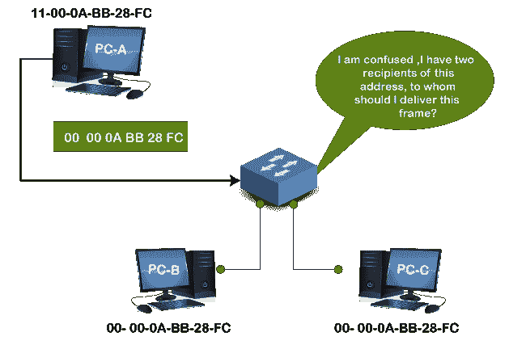
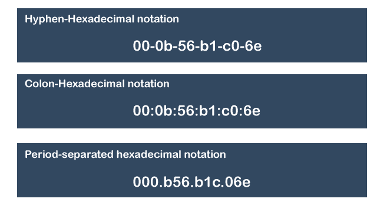
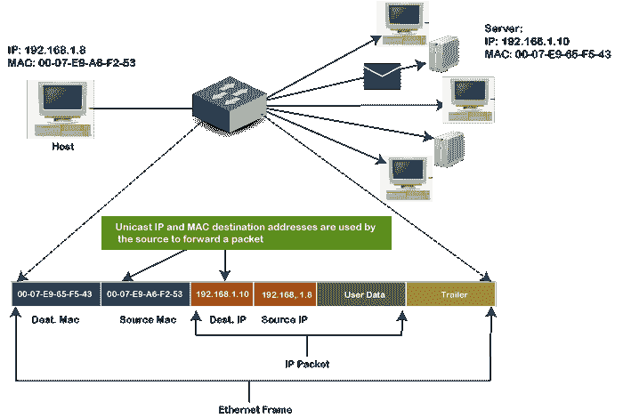
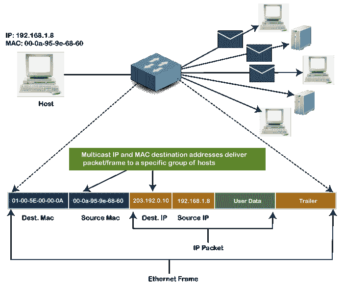
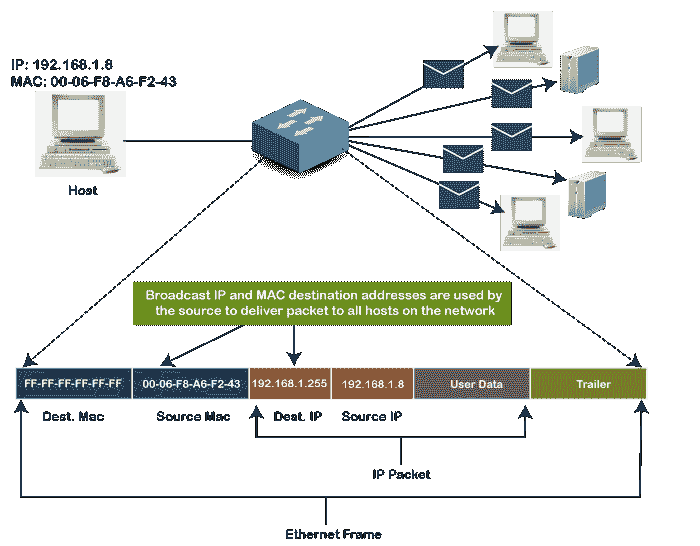
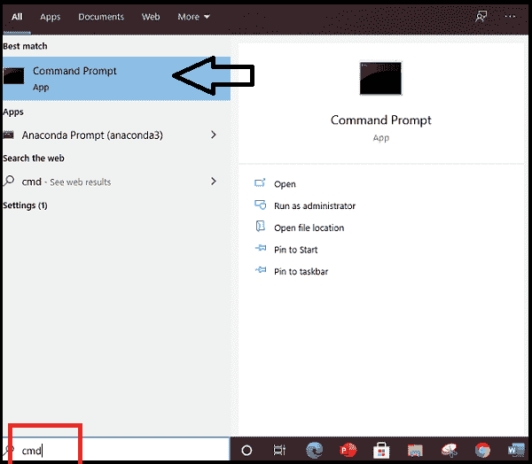
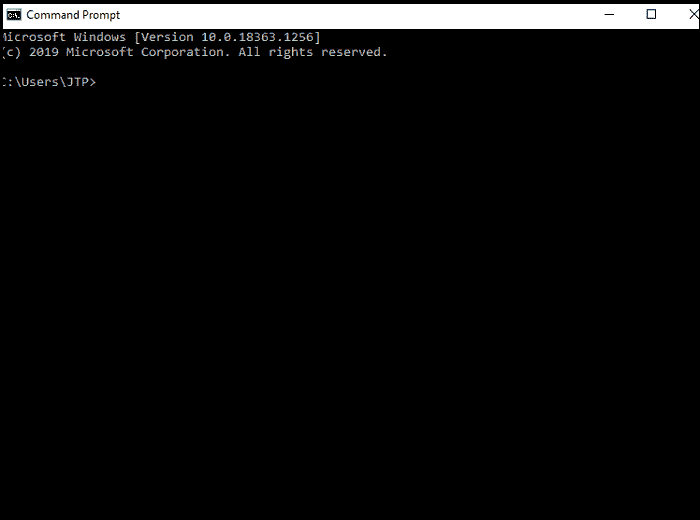
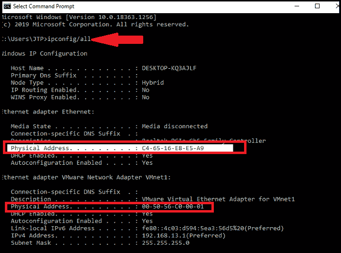

# 什么是媒体访问控制地址？

> 原文：<https://www.javatpoint.com/what-is-mac-address>

*   媒体访问控制地址是物理地址，它唯一地标识给定网络上的每个设备。要在两台联网设备之间进行通信，我们需要两个地址: **IP 地址和 MAC 地址。**分配给每个可以连接到互联网的设备的网卡(网络接口卡)。
*   它代表**媒体访问控制**，也称为**物理地址、硬件地址或 BIA(烧入地址)。**
*   它是全球独一无二的；这意味着两台设备不能有相同的 MAC 地址。它在每个设备上以十六进制格式表示，如 **00:0a:95:9d:67:16。**
*   12 位，48 位长，其中前 24 位用于 **OUI** (组织唯一标识符)和 *24 位用于网卡/供应商特定。*
*   它在现场视察模型的数据链路层工作。
*   它由设备供应商在制造时提供，并嵌入其网卡中，理想情况下是不能更改的。
*   **ARP 协议**用于将逻辑地址与物理或媒体访问控制地址相关联。

## 同时拥有 IP 和 MAC 地址的理由。

既然我们已经有了将电脑连接到互联网的 IP 地址，为什么我们还需要 T2 MAC 地址。这个问题的答案是，每个 mac 地址都被分配给硬件设备的 [NIC](https://www.javatpoint.com/nic-full-form) ，这有助于识别网络上的设备。

当我们请求在互联网上加载页面时，请求会被响应并发送到我们的 [IP](https://www.javatpoint.com/ip-full-form) 地址。

媒体访问控制地址和 IP 地址都在互联网协议组的不同层上运行。媒体访问控制地址在第 2 层工作，有助于识别同一广播网络中的设备(如路由器)。另一方面，IP 地址用于第 3 层，有助于识别不同网络上的设备。

我们有通过不同网络识别设备的 IP 地址，但我们仍然需要一个 MAC 地址来查找同一网络上的设备。

### 为什么 MAC 地址在局域网中应该是唯一的？

如果一个[局域网](https://www.javatpoint.com/wireless-lan-introduction)有两个或更多设备具有相同的媒体访问控制地址，该网络将无法工作。

假设三个设备 A、B 和 C 通过一个交换机连接到一个网络。这些设备的媒体访问控制地址分别是 11000ABB28FC、00000ABB28FC 和 00000ABB28FC。设备 B 和 C 的[网卡](https://www.javatpoint.com/network-interface-card)有相同的 MAC 地址。如果设备 A 向地址 00000ABB28FC 发送数据帧，交换机将无法将该帧传送到目的地，因为它有两个数据帧接收者。

我们可以通过下图理解这个例子:

## 媒体访问控制地址的格式

正如我们在上面一节中已经讨论过的，我们不能将媒体访问控制地址分配给设备的网卡；它是由制造商预先配置的。那么，让我们了解它是如何配置的，以及选择了什么格式。

*   它是 12 位或 6 字节的十六进制数，用冒号十六进制表示格式表示。它分为六个八位字节，每个八位字节包含 8 位。
*   前三个八位字节用作 **OUI 或组织唯一标识符**。这些媒体访问控制前缀由 IEEE 注册管理机构委员会分配给每个组织或供应商。
*   已知供应商 OUI 的一些例子有:
    **CC:46:D6 -思科**
    T4】3C:5A:B4-谷歌公司
    **3C:D9:2B -惠普**
    T10】00:9A:CD-华为技术有限公司
    T13】
*   最后三个八位字节是特定于网卡的，由制造商用于每个网卡。供应商或制造商可以在网卡特定数字上使用任何数字序列，但前缀应与 IEEE 提供的相同。
*   媒体访问控制地址可以用以下三种格式表示:
    

## 媒体访问控制地址的类型

有三种类型的媒体访问控制地址，它们是:

1.  **单播媒体访问控制地址**
2.  **组播媒体访问控制地址**
3.  **广播 MAC 地址**

### 单播媒体访问控制地址:

单播媒体访问控制地址代表网络上的特定网卡。单播媒体访问控制地址帧只发送到分配给特定网卡的接口，然后传输到单个目的设备。如果地址第一个二进制八位数的最低有效位设置为零，则帧只能到达一个目的网卡。

### 多播媒体访问控制地址:

多播地址使源设备能够向多个设备或网卡传输数据帧。在第 2 层(以太网)多播地址中，地址的第一个八位字节的 LSB(最低有效位)或前 3 个字节被设置为 1，并为多播地址保留。其余的 24 位由想要以组的形式发送数据的设备使用。多播地址总是以前缀 01-00-5E 开头。

### 广播媒体访问控制地址

它代表网络中的所有设备。在广播媒体访问控制地址中，目的地址(FF-FF-FF-FF-FF-FF)的所有位都为 1 的以太网帧被称为 b **路播地址**。所有这些位都是广播的保留地址。以媒体访问控制地址为目的地的帧将到达属于该局域网段的每台计算机。因此，如果源设备想要向网络中的所有设备发送数据，可以使用广播地址作为目的地媒体访问控制地址。

## 如何找到设备的 MAC 地址

我们可以通过任何操作设备轻松找到或检查计算机设备的地址。连接到家庭网络的每个设备都包含一个唯一的媒体访问控制地址，但是如果您的系统有多个网络适配器，如以太网适配器或无线适配器，每个适配器或网卡都有自己的媒体访问控制地址或物理地址。

按照以下步骤[在不同的操作系统上找到设备的媒体访问控制地址](https://www.javatpoint.com/how-to-find-mac-address-in-windows-10)。

**Windows 上的 MAC 地址:**

1.点击**窗口开始**或按窗口键。

2.在给定的搜索框中，键入 **cmd** 打开命令提示符。

3.按回车键，将显示命令提示窗口，如下图所示:

4.键入 ipconfig/all 命令，然后按 enter 键。

5.它会显示不同的信息，向下滚动并寻找物理地址。每个物理地址都是设备的媒体访问控制地址。

如上图所示，有两个物理地址显示为不同的值，一个用于以太网适配器，另一个用于 VMware 网络适配器。

### 麦金塔操作系统上的媒体访问控制地址:

按照以下步骤在麦金塔操作系统上查找媒体访问控制地址:

1.  选择苹果图标或打开苹果菜单，然后单击系统偏好设置。
2.  在系统偏好设置→选择网络→
3.  上述路径将打开一个网络盒。
4.  从这里选择无线网络选项。它将显示无线网络地址或机场地址显示；这是您设备的 MAC 地址。

## 媒体访问控制地址的克隆

媒体访问控制克隆是一种通过互联网服务提供商解决设备连接问题的方法。在这种方法中，我们需要将设备广域网端口的媒体访问控制地址设置为您的电脑或其他设备的类似媒体访问控制地址。

连通性问题主要出现在我们向网络添加新的媒体访问控制地址时，这个问题可以通过媒体访问控制克隆来解决。

例如，某些互联网服务提供商在安装服务时会使用您设备的媒体访问控制地址。现在，如果我们在电缆调制解调器或 DSL 调制解调器后面放置路由器，ISP 将无法从设备的广域网端口识别媒体访问控制地址。对于这种情况，您可以呼叫 ISP 提供商来注册您设备的媒体访问控制地址，也可以将广域网端口的媒体访问控制地址克隆到与计算机媒体访问控制地址相同的地址。

## 媒体访问控制地址和 IP 地址的区别

媒体访问控制地址和 IP 地址都是在网络上识别设备的方式。以下是两者之间的一些重要区别:

| mac 地址 | 国际电脑互联网地址 |
| 它代表媒体访问控制。 | 它代表互联网协议。 |
| 这是制造商提供的唯一地址。 | 它是由互联网服务提供商提供的逻辑地址。 |
| 它是设备网卡的物理地址，用于识别网络中的设备。 | 它是标识互联网上网络或设备的逻辑地址。 |
| 它在数据链路层运行。 | 它在网络层运行。 |
| 它是 6 字节的十六进制地址。 | IPv4 为 4 字节，IPv6 地址为 8 字节。 |

* * *