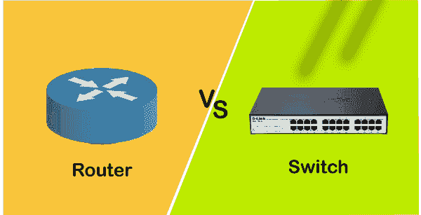
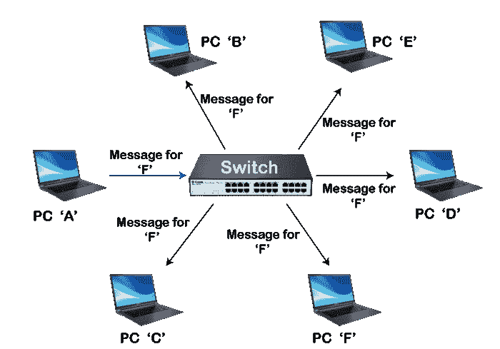
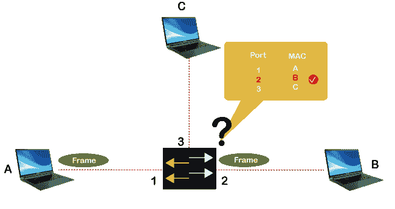
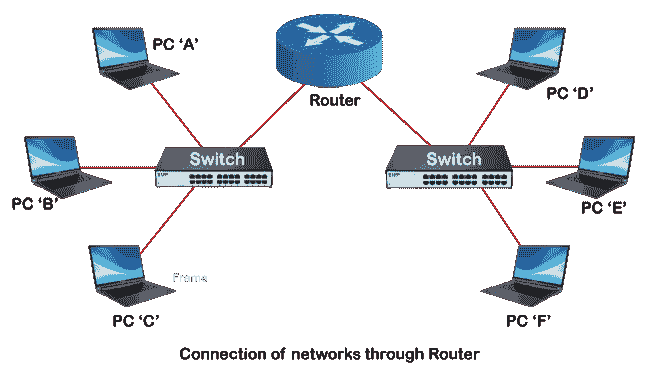

# 交换机与路由器|交换机与路由器的区别

> 原文：<https://www.javatpoint.com/switch-vs-router>

交换机和路由器是网络的两个重要组成部分。虽然两者都是网络中的连接设备，有时人们认为它们是相同的，但两者具有不同的功能。在本主题中，我们将看到交换机和[路由器](https://www.javatpoint.com/router)是如何区分的。

## 什么是开关？

*   *交换机是一种网络设备，它通过连接不同的网络设备*，如小型企业网络中的**计算机、打印机和服务器** *，提供共享信息&资源的设施。*
*   在交换机的帮助下，连接的设备可以共享数据和信息并相互通信。
    
*   没有交换机，我们就无法构建小型企业网络，也无法连接建筑物或校园内的设备。

### 开关的类型

网络中主要有两种类型的交换机，如下所示:

*   **非托管交换机**
    非托管交换机主要用于基本连接。这些大多用于小型网络或只需要很少端口的地方，例如家里、实验室或会议室。在非托管交换机中，不需要任何配置，这意味着只需插入即可正常工作。
*   **受管交换机**
    受管交换机比非受管交换机更安全，并提供其他功能和灵活性，因为我们可以轻松配置它们来定制我们的网络。因此，我们可以有更大的控制权，也可以更好地保护我们的网络，提高那些访问网络的服务质量。

### 开关是如何工作的？

正如我们所知，每个网络设备都包含一个唯一的媒体访问控制地址。当一台设备或计算机向另一台设备发送一个 IP 数据包时，交换机将该 IP 数据包与源媒体访问控制地址和目的媒体访问控制地址放在一起，并用一个帧将其封装，然后发送到另一台设备。

当帧到达目的设备时，它会被剥离，设备会获得 IP 数据包，并且只到达与输入的目的 MAC 地址匹配的设备。

### 开关的优点

*   它提高了网络的可用带宽。
*   它可以直接连接到工作站或设备。
*   增强网络性能。
*   带有交换机的网络具有较少的帧冲突，这是因为交换机为每个网络开发了冲突域。
*   它有助于减少个人电脑等主机的工作负载。

## 什么是路由器？

*   *路由器是用于连接多台交换机及其对应网络，构建大型网络的组网设备。*这些交换机及其对应的网络可能在同一个位置，也可能在不同的位置。
    T3】
*   路由器是一种智能设备，负责通过网络将数据包从源路由到目的地。 ***它还将互联网连接从调制解调器分发或路由到所有有线或无线网络设备，如电脑、笔记本电脑、手机、平板电脑等***
*   它主要执行两个功能；
    *   **创建和维护局域网，**
    *   **管理进入&离开数据。**
*   路由器连接多个网络，允许联网设备和用户访问互联网。
*   它在**网络层** &上工作，通过网络中最短的路径路由数据包。

### 路由器的工作

*   在家庭或办公室中，我们有各种联网设备，如电脑、平板电脑、打印机等。，通过路由器，这些设备可以连接到互联网并形成网络。路由器首先将调制解调器连接到其他设备，以允许这些设备与互联网之间的通信。
    
*   路由器将具有定义的 IP 地址的数据包从一个网络路由/传输到另一个网络或网络内。它通过在互联网上为每台设备提供一个本地 IP 地址来做到这一点；它确保正确的目的地，以便数据到达正确的位置，而不是在网络中丢失。
*   它找出最佳和最快的路径，然后将数据包从该路径发送到网络中连接的设备。
*   它的工作原理类似于具有定义地址的投递包，只到达正确的收件人。

### 路由器的类型

路由器主要有两种类型，如下所示:

**1。无线路由器**

*   无线路由器是办公室和家庭中最常用的路由器，因为它们不需要任何电线或电缆来连接网络设备。
*   它提供了一个安全的连接，只有经过身份验证的用户才能使用 id & password 访问网络。
*   使用无线路由器，指定范围内的 n 个用户可以访问互联网。

**2。有线路由器/宽带路由器**

*   顾名思义，它需要电线或电缆来连接网络设备。
*   这种路由器主要用于学校或小型办公室，通过以太网电缆连接电脑。
*   它还有一个无线接入点，手机可以使用网络电话技术连接到它。
*   它连接到 ADSL 调制解调器，从调制解调器获取传输数据，并将其分发到另一个网络。

### 路由器的优势

*   无线路由器最常用于使大多数网络设备能够随时轻松连接，而无需担心一堆电线。
*   它可以连接网络的不同架构，如**以太网电缆、Wi-fi 或 WLAN。**
*   它通过密码保护提供高度安全的网络访问。
*   它借助碰撞功能减少了网络流量。
*   它使用路由表和智能信息，以最佳路由将数据包发送到正确的目的地。

## 交换机和路由器的主要区别

*   交换机的主要功能是连接计算机、打印机等终端设备。，而路由器的主要功能是连接两个不同的网络。
*   交换机在现场视察模型的数据链路层上工作；另一方面，路由器在 OSI 模型的*网络层*工作。
*   交换机旨在确定接收到的 IP 数据包的目的地址，并将其转发到目的地址。另一方面，路由器的主要目的是为数据包找到到达目的地的最小和最佳路由，这是使用路由表确定的。
*   交换机使用各种交换技术，如电路交换、分组交换和消息交换。相比之下，路由器使用两种路由技术，即自适应路由和非自适应路由技术。
*   交换机将媒体访问控制地址存储在查找表或计算机辅助制造表中，以获取源地址和目的地址。相比之下，路由器将 IP 地址存储在路由表中。

## 交换机和路由器之间的差异图

| 转换 | 路由器 |
| 它连接网络中的多个联网设备。 | 它连接多个交换机及其对应的网络。 |
| 它在现场视察模型的数据链路层工作。 | 它在现场视察模型的网络层工作。 |
| 它在局域网内使用。 | 它可以用于局域网或城域网。 |
| 交换机无法执行网络地址转换或网络地址转换。 | 路由器可以执行网络地址转换。 |
| 交换机在做出复杂的路由决策时需要更多的时间。 | 路由器做出路由决定的速度比交换机快得多。 |
| 它只提供端口安全性。 | 它提供安全措施来保护网络免受安全威胁。 |
| 它属于半智能设备的范畴。 | 它被称为智能网络设备。 |
| 它在半双工或全双工传输模式下工作。 | 它在全双工传输模式下工作。但是，我们可以手动将其更改为半双工模式。 |
| 它以帧(对于 L2 交换机)和数据包(对于 L3 交换机)的形式将信息从一台设备发送到另一台设备。 | 它以数据包的形式将信息从一个网络发送到另一个网络。 |
| 交换机只能与有线网络一起工作。 | 路由器可以与有线和无线网络一起工作。 |
| 交换机有不同的端口，例如 8、16、24、48 和 64。 | 默认情况下，路由器包含两个端口，例如快速以太网端口。但是我们也可以显式添加串行端口。 |
| 它使用内容可寻址存储器表作为源地址和目的地址。 | 它使用路由表来获得目的 IP 的最佳路由。 |

## 结论

根据以上讨论，我们可以得出结论，两者都是建立网络的重要设备，在网络中都有各自的意义。然而，要建立家庭网络并连接设备，我们需要一台交换机，而要连接两个网络，我们需要一台路由器。

* * *