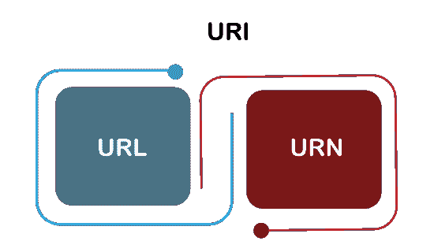
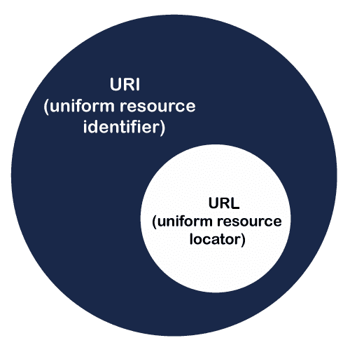

# URI vs 网址| URI 和网址的区别

> 原文：<https://www.javatpoint.com/uri-vs-url>


在网上冲浪或查看任何网站时，您可能会多次遇到“URI”和“网址”这两个词。这是 web 的两个重要概念，通常可以互换使用。但是它们彼此不一样；URI 和 URL 的主要区别在于 ***URI 可以同时表示一个资源的 URL 和 URN，而 URL 只能指定该资源在互联网上的地址*** 。在本主题中，我们将分别看到 URI 和网址，以及如何区分两者。

## 什么是 URI？

URI 或**统一资源标识符**是指互联网上的资源的字符串标识符。它是一个字符串，用于使用位置、名称或两者来识别[互联网上的任何资源。](https://www.javatpoint.com/internet)

一个 URI 有两个子集； [**URL(统一资源定位符)**](https://www.javatpoint.com/url-full-form) 和 **URN(统一资源号)**。如果它只包含一个名称，则意味着它不是一个网址。我们在现实世界中看到的大多是网址和 URN，而不是直接的 URI。



一个 URI 包含**方案、权限、路径、查询和一个片段。**一些最常见的 URI 方案是**[HTTP](https://www.javatpoint.com/computer-network-http)[HTTPs](https://www.javatpoint.com/https)[FTP](https://www.javatpoint.com/computer-network-ftp)【Idap】[telnet](https://www.javatpoint.com/computer-network-telnet)等**。

### URI 句法

URI 的语法如下:

```

scheme:[//authority]path[?query][#fragment]

```

*   **方案:**URI 的第一个组成部分是包含一系列字符的方案，这些字符可以是字母、数字、加号或连字符(_)的任意组合，后跟冒号(:)。流行的方案是 **http、file、ftp、data 和 irc。**计划应在 IANA 注册。
*   **权限:T** 权限组件是可选的，前面有两个斜杠(//)。它包含三个子组件:
    *   **userinfo:** 它可能包含一个用户名和一个可选密码，用冒号分隔。子组件后面是@符号。
    *   **主机:**包含注册名称或 IP 地址。IP 地址必须用[]括起来。
    *   **端口:**可选
*   **路径:**它由一系列由斜杠(/)分隔的路径段组成。URI 总是指定它；但是，指定的路径可能为空或长度为 0。
*   **查询:**是可选组件，前面加问号(？).它包含非层次数据的查询字符串。
*   **片段:**它也是一个可选组件，前面有一个哈希(#)符号。它由一个片段标识符组成，为辅助资源提供方向。

### URI 的一些例子

1.  mailto: [【邮件保护】](/cdn-cgi/l/email-protection)
2.  新闻:comp . info systems . www . servers . UNIX
3.  urn:oasis:名称:规范:docbook:dtd:xml:4.1.2

## 网址是什么？

网址或**统一资源定位符**用于在网络上查找资源的位置。它是资源的引用和访问该资源的方式。网址总是显示一个唯一的资源，它可以是一个网页、一个 CSS 文档、一个图像等。

网址使用协议来访问资源，可以是 HTTP、HTTPS、FTP 等。

它主要是指网站的地址，用户可以在地址栏中找到。以下是一个网址示例:


#### 注意:所有网址都可以是 URIs，但所有 URIs 不能是网址。这是因为 URI 包含网址和 URN，代表网址或 URN，或者两者都有。



### 网址的语法

每个 HTTP 网址都遵循其通用 URI 的语法。因此，网址的语法也类似于 URI 的语法。如下所示:

```

scheme:[//authority]path[?query][#fragment]

```

上述网址由以下组件组成:

*   **Scheme:**URL 的第一个组成部分是 Scheme，它表示浏览器请求资源时必须使用的协议。网站常用的协议是 HTTP 或 HTTPS。
*   **权限:**权限包括两个子组件，**域名和端口**，中间用冒号分隔。域名可以是任何东西，资源的注册名称像**、**和端口是在网络服务器上访问资源的技术大门。端口号 **80 用于 HTTP** ， **443 用于 HTTP** S。
*   **路径:**该路径表示网络服务器上资源的完整路径。可以像**/软件/html/index . html .**
*   **查询字符串:**是包含名称和值对的字符串。如果在 URL 中使用它，它将遵循路径组件并给出信息。比如**“怎么样？键 1 =值 1 &键 2 =值 2”。**
*   **片段:**它也是一个可选组件，前面有一个哈希(#)符号。它由一个片段标识符组成，为辅助资源提供方向。

## URI 和网址的主要区别

*   URI 包含网址和 URN 来标识资源的名称和位置或两者；相比之下，URL 是 URI 的子集，仅标识资源的位置。
*   URI 的例子是**瓮:isbn:0-476-27557-4，**而网址的例子是**https://google.com。**
*   URI 可以用来在 HTML、XML 和其他文件中查找资源，而网址只能用来定位网页。
*   每个网址可以是一个 URI，而所有 URIs 不能总是网址。

## URI 和网址之间的差异图

| 上呼吸道感染 | 统一资源定位器 |
| URI 是统一资源标识符的缩写。 | 网址是统一资源定位符的缩写。 |
| URI 包含两个子集，告诉名字的 URN 和告诉位置的 URL。 | URL 是 URI 的子集，它告诉资源的唯一位置。 |
| 所有的 URIs 都不能是网址，因为它们可以告诉你名字或位置。 | 所有的网址都是 URIs，因为每个网址只能包含位置。 |
| URI 旨在通过使用资源名称或资源位置来识别资源并将其与其他资源区分开来。 | 网址的目的是在网上找到资源的位置或地址。 |
| URI 的一个例子可以是 ISBN 0-486-35557-4。 | 网址的一个例子是 https://www.javatpoint.com。 |
| 它通常用在 XML 和标记库文件中，如 JSTL 和 XSTL，以识别资源和二进制文件。 | 它主要用于搜索互联网上的网页。 |
| URI 方案可以是协议、名称、规范或任何东西。 | URL 的方案通常是 HTTP、HTTPS、FTP 等协议。 |

## 结论

根据上面的讨论，我们现在可以区分 URI 和网址。URI 是一个字符序列，通过互联网上的**位置、名称或**来识别网络资源。而 URL 是一个字符序列，它只标识互联网上可用资源的位置。

* * *