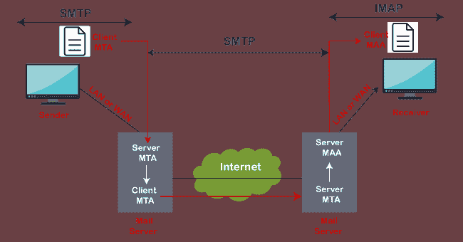

# IMAP 与 POP3 |与 POP3 的区别

> 原文：<https://www.javatpoint.com/imap-vs-pop3>

**POP3 和 IMAP** 是流行的电子邮件协议，用于访问来自第三方电子邮件客户端或软件的电子邮件。这两个是互联网上常用的电子邮件协议。这两种协议都有助于通过电子邮件客户端连接到邮件服务器，您可以通过电子邮件客户端设置电子邮件地址。我们可以选择其中任何一个来设置我们的电子邮件地址。与简单邮件传输协议(SMTP)类似，POP3 和 IMAP 也有特定的功能和工作原理。让我们详细讨论 POP3 和 IMAP，以及它们的区别。

## 什么是 IMAP？

[IMAP](https://www.javatpoint.com/imap-protocol) 缩写为**互联网消息访问协议**。 *IMAP 是一种互联网协议，用于从本地客户端管理和检索远程服务器上的电子邮件。它*也作为 MAA **或消息访问代理**工作。因为 IMAP 处理信息检索，所以我们不能在互联网上使用 IMAP 协议发送电子邮件。所有电子邮件客户端和网络服务器都支持 IMAP 协议。

**IMAP 的工作如下图所示:**

### 什么时候用 IMAP？

如果您从不同的设备访问您的电子邮件，如移动设备、笔记本电脑和工作站台式机等。，那么使用 IMAP 协议总是更好。

### IMAP 的特点

IMAP 有以下一些特性:

*   电子邮件存储在服务器上，而不是电子邮件客户端。
*   已发送的邮件也存储在服务器端的“已发送”文件夹中，这使我们可以从任何地方检查已发送的电子邮件。
*   您可以同步消息，并从多个设备访问您的电子邮件。
*   它更加复杂和灵活。
*   它有助于从美国在线下载电子邮件数据到您的设备或软件。
*   即使我们的设备被破坏或被盗，我们也不会丢失电子邮件。
*   服务器还保存电子邮件的状态，如已读、未读或已回复。它有助于检查来自任何计算机或设备的电子邮件的状态。
*   当我们开始使用 IMAP 下载电子邮件时，它首先显示标题(发件人、日期、电子邮件主题)；在那一刻，我们可以决定是否下载电子邮件。

## 什么是 POP3？

POP3 缩写为**邮局协议**，数字三代表“版本 3”，是最新版本，也是互联网上使用最广泛的电子邮件协议。与 IMAP 协议类似，它是从远程服务器接收电子邮件的另一种协议。它还充当消息访问代理，将消息从邮件服务器检索到接收者的系统。它有助于保护电子邮件免受互联网上的垃圾邮件和病毒的侵害。

POP3 在两种模式下工作:**删除模式**和**保留模式。**

当用户从永久设备访问电子邮件服务时，它在**删除模式**下工作。在这种情况下，一旦从邮箱中下载或检索到邮件，邮件就会从邮箱中永久删除。

当用户没有从主设备访问邮件时，它在**保持模式**下运行。在这种情况下，它会保留检索后的邮件，以便以后检索。

### 何时使用 POP3？

在以下情况下使用 POP3:

*   如果我们想使用单一设备访问邮件，我们应该使用 POP3
*   如果邮件数量多。
*   如果我们想离线查看邮件。

### POP3 的特点

*   在 POP3 中，所有的电子邮件都被下载到本地计算机上，一旦所有的电子邮件都被下载，它们就会从服务器上删除。
*   下载的电子邮件也可以离线访问。
*   不同设备之间的电子邮件不同步，这意味着如果我们使用带有 POP3 的手机设置电子邮件，这些电子邮件将完全下载到您的手机上，并且无法从其他设备访问。

## IMAP 和 POP3 的差异表

| 特征 | 因特网邮件访问协议 | POP3 |
| 代表 | IMAP 代表互联网消息访问协议。 | 它代表邮局协议。 |
| 用于 | IMAP 是一种高级协议，允许用户检查邮件服务器上的所有文件夹，并用于检索邮件。 | 与 IMAP 相比，POP 是一个简单的协议，仅用于将邮件从我们的收件箱下载到本地计算机。 |
| 通道数 | 它在端口号 143 上监听，而 IMAPDS(带有 SSL 的 IMAP)在端口 993 上监听。 | 它监听端口号 110，POP3DS(带有 SSL 的 POP3)监听端口 995。 |
| 易接近 | 使用 IMAP，可以使用不同的设备访问消息。 | 使用 POP3，一次只能使用一个设备访问邮件。 |
| 可读性 | 我们可以在完成下载之前部分阅读消息。 | 我们只能在消息下载后阅读它。 |
| 变化 | 在 IMAP 中，邮件可以使用电子邮件软件或网络界面进行更新。 | 在 POP3 中，可以使用本地电子邮件软件更新邮件。 |
| 更新 | IMAP 允许用户在邮件服务器上创建、删除或更新邮箱，还允许在文件夹中创建邮箱层次结构。 | POP3 不允许用户创建、删除或更新邮件服务器上的邮箱。 |
| 邮件组织 | 它允许用户在服务器上组织邮件。 | 它不允许在服务器上组织邮件。 |
| [计] 下载 | 在 IMAP 中，下载邮件之前会预览邮件头。 | 使用 POP3，可以一次下载所有消息。 |
| 电子邮件存储 | 电子邮件一旦下载并从服务器上删除，就会存储在一个设备上。 | 电子邮件存储在服务器上并同步&可以使用多种设备访问。 |

## 结论

根据上面的讨论，我们可以得出结论，IMAP 更强大，如果我们想使用多种设备访问我们的电子邮件，例如使用智能手机和计算机，最好使用它。另一方面，如果我们只使用一台设备访问邮件，并且有大量的电子邮件，并且想离线访问这些电子邮件，POP3 是合适的。

* * *