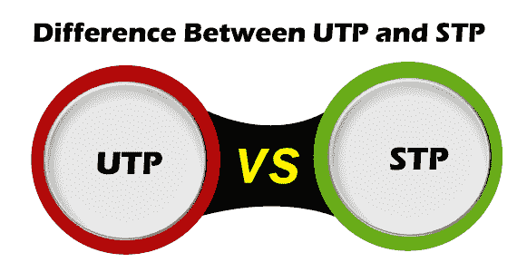
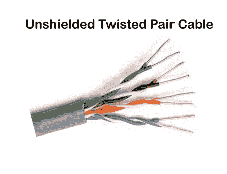
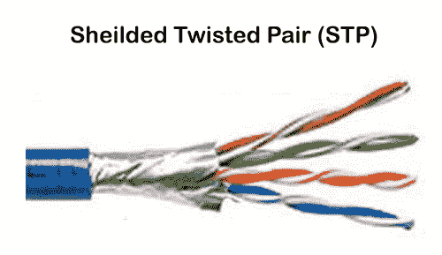

# UTP 和 STP 的区别

> 原文：<https://www.javatpoint.com/utp-vs-stp>

在了解 UTP 电缆和 STP 电缆的区别之前，我们需要学习术语**双绞线电缆**。双绞线是一种广泛使用的电缆，用于在一定距离内传输数据和信息。双绞线电缆由两根独立的绝缘铜线组成，这些铜线在一个包裹屏蔽罩内绞合在一起，并相互平行。此外，它有助于减少线对之间的串扰或电磁感应。双绞线分为两部分，分别为和 **UTP** 。

## UTP(非屏蔽双绞线)

UTP 是一种非屏蔽双绞线电缆，用于计算机和电信介质。它的频率范围适合通过 UTP 电缆传输数据和语音。因此，它被广泛应用于电话、电脑等。它是一对绝缘铜线绞合在一起，以减少外部干扰产生的噪音。这是一种没有额外屏蔽的电线，如铝箔，以保护其数据免受外部影响。

### UTP 的优势:

1.  这是一种成本更低、来自另一种网络介质的非屏蔽导线。
2.  它旨在减少串扰、射频干扰和电磁干扰。
3.  它的体积很小，因此安装 UTP 更容易。
4.  它主要用于家庭和小型组织等短距离网络连接。
5.  它是市场上最常用的网络电缆。它被认为是更快的铜基数据传输电缆。
6.  它适用于通过 UTP 电缆传输数据和语音。

### UTP 的劣势:

1.  它只能用于长达 100 米的长度段。
2.  它传输数据的带宽有限。
3.  它不能为网络上的数据传输提供安全连接。

## 屏蔽双绞线:

屏蔽双绞线是一种双绞线电缆，包含额外的包裹箔或铜编织护套，以保护电缆免受切割、带宽损失、噪声和信号干扰等缺陷的影响。这是一种通常在地下使用的电缆，因此比 UTP 贵。它支持长距离更高的数据传输速率。我们也可以说它是一种带有金属护套或涂层的电缆，围绕每对绝缘导体，以保护电线免受外部用户的影响，并防止电磁噪声穿透。

### 屏蔽双绞线电缆的特点:

1.  **频率:**与 UTP 相比，它的数据传输频率更高。
2.  **厚度:**它是一种厚屏蔽双绞线电缆，因为它包含塑料材料到铜导体的包裹。
3.  **接地做法:**屏蔽双绞线电缆的用途是在地下较长的距离。
4.  **屏蔽线的安装**比 UTP(非屏蔽双绞线)电缆更困难。

### STP 电缆的优点

1.  它比 UTP 有更低的噪音和衰减。
2.  它用塑料盖屏蔽，保护 STP 电缆免受恶劣环境的影响，并提高数据传输速率。
3.  它减少了串扰的机会，并保护免受外部干扰。
4.  模块化连接有助于终止 STP 电缆的连接。

### STP 电缆的缺点

1.  这是 UTP 电缆中最贵的电线。
2.  它需要更多的维护来减少数据信号的丢失。
3.  尽管其连接较厚且较重，但在长度上没有分段改进。
4.  它仅用作接地线。

## UTP 和 STP 的区别

以下是 UTP 和圣多美和普林西比的区别:

| 非屏蔽双绞线 | 短时程增强 |
| 它是非屏蔽双绞线。 | 它是屏蔽双绞线。 |
| UTP 电缆是一种双绞线电缆，其电线是绞合在一起的。 | 它被封装在箔片或网罩内。 |
| 与 STP 相比，UTP 的价格更低。 | STP 的价格比 UTP 贵很多。 |
| 它不需要接地电缆。 | 它需要一根接地电缆。 |
| 在 UTP，将信号传输到传输介质时，电磁干扰比 STP 更大。 | 它减少了电磁干扰，同时将信号传输到传输介质。 |
| UTP 的相声水平很高。 | STP 串扰低。 |
| 与 STP 相比，数据信号的传输速度较慢。 | 与 UTP 相比，数据信号的传输速度较高。 |
| 安装 UTP 电缆很容易，因为它们更轻，体积小，而且灵活。 | 与 UTP 相比，STP 电缆的安装相当困难。它的尺寸很重，更大，更硬。 |
| 它不需要太多的维护。 | 它需要更多的维护。 |
| UTP 的电报噪音更大。 | STP 电缆噪音较小。 |
| 然而，UTP 电缆用于在短距离内建立连接，如家庭或小型企业。 | 一般用于企业远距离建立连接。 |

* * *