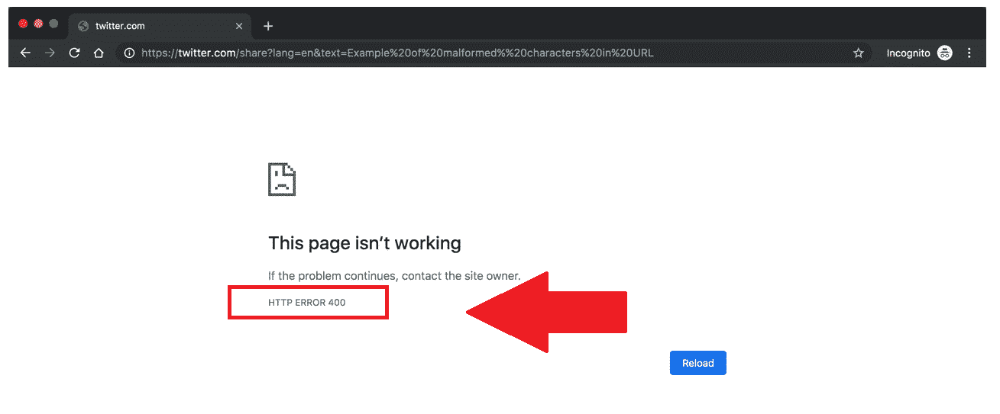
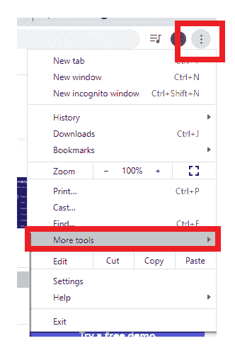
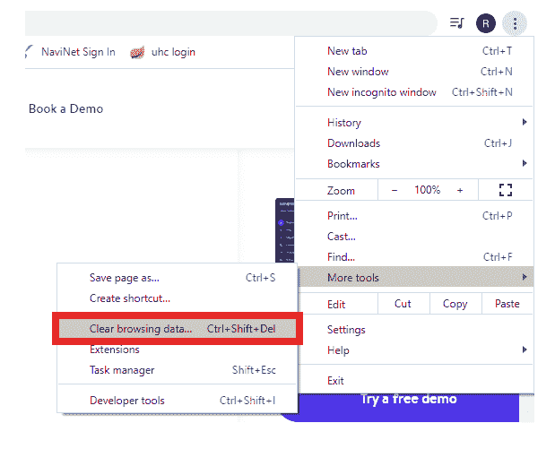
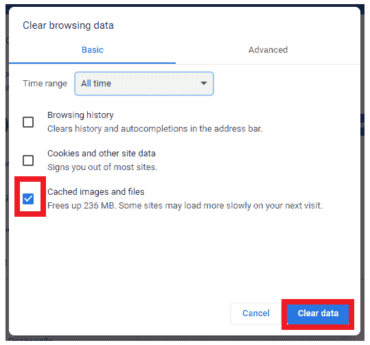
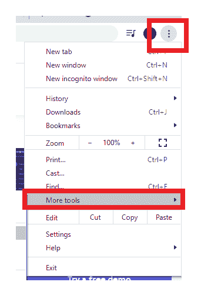
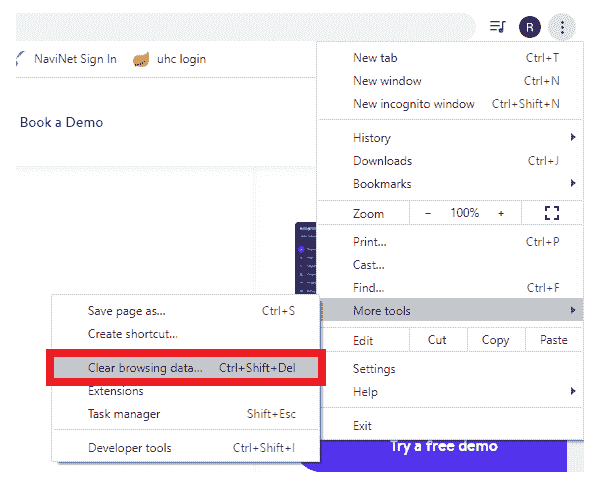
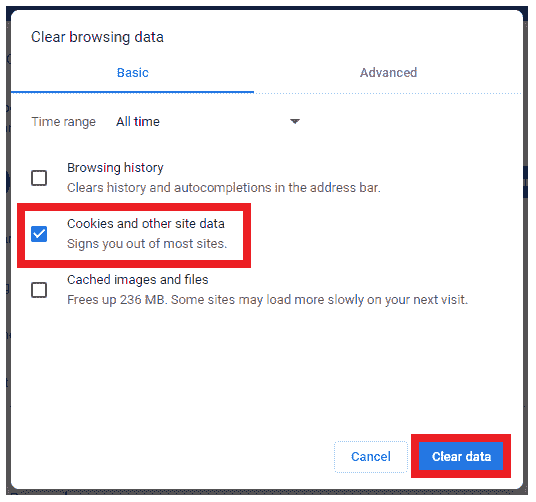

# 状态代码 400

> 原文：<https://www.javatpoint.com/status-code-400>

一个 [HTTP(超文本传输协议错误)](https://www.javatpoint.com/http-tutorial)状态代码 400 代表一个用户错误。每当任何用户向服务器发送无效请求时，服务器都会立即报告它，并生成一个基于 HTTP 的 400 错误请求错误。如果用户输入了不正确的网址，通常会出现此错误。

在大多数可能的情况下，状态代码 400 错误是由于向服务器提交的请求或本地缓存原因导致的客户端问题而发生的。因此，在本教程中，我们将涵盖各种简单的方法，任何人都可以实现，即使用户不熟悉技术。按照给定的方法，你应该能够成功地让你的网站工作！

## 什么是 400 错误请求错误？

[状态码](https://www.javatpoint.com/http-status-codes) 400 或 400 错误请求，或 400 错误或 HTTP 错误 400，被服务器识别为一般用户错误。如果服务器决定产生的错误不属于任何其他状态代码分类，服务器将抛出 400 错误。

400 状态代码(错误请求)表示由于某些用户错误，服务器无法处理该请求。作为对无效请求的回报，在请求失败的情况下，服务器应该分发特定的 4xx 状态代码。

## 400 错误的常见原因

400 错误请求错误主要是由于在浏览器窗口中键入了不正确的网址，或者在将地址链接从一个网页链接到另一个网页时出错。

**1。网址字符串语法错误**

发生 HTTP 错误 400 的主要原因是键入的网址(统一资源定位符)不正确、语法不正确或网址包含一些非法字符。

尽管用户可能会错误地键入错误的网址，但如果网址编码执行不正确，有时也会发生这种情况。下面给出的链接是服务器不会处理的错误网址的一个例子，因此，它将触发 400 HTTP 错误。

[https://twitter.com/share?lang=en&文本=示例% 20% 20 格式% % 20 字符% 20 英寸% 20 网址](https://twitter.com/share?lang=en&text=Example%20of%20malformed%25%20characters%20in%20URL)

**2。损坏的浏览器缓存&cookie**

URL 输入错误并不是服务器触发 400 错误的唯一情况。即使传递的网址是 100%准确的，服务器仍然可以抛出 400 错误请求，因为它检测到浏览器缓存内存中存在任何损坏的文件或其他问题，如过期或损坏的 cookies。

如果用户在上次登录一段时间后试图访问他们的 WordPress 管理区域，他/她也会遇到 400 错误请求。出现这种情况的原因是 cookie 管理登录身份验证信息的过程可能已经过期，并且它无法进一步验证具有管理员权限的同一有效用户。它最终导致连接被拒绝，因此通过 400 错误请求错误。

**3。域名系统查找缓存**

如果存储的本地域名系统数据与注册的域名系统(域名服务器)数据不同步，可能会出现 400 错误请求。互联网上所有的域名都是 IP 地址的艺术。当您的电话号码连接到您想要拨打的特定“主叫号码”时，您可以比较它的 IP 地址。

**4。文件大小过大**

如果用户在网站上上传的文件太重，无法满足上传请求，也会触发 400 错误请求。这与服务器的文件大小限制严格相关，并将根据其设置而变化。

**5。通用服务器错误**

如果服务器端存在任何技术问题，也会出现 400 错误请求错误。尽管如此，400 状态代码将显示服务器的一般问题、服务器或网络故障，或任何其他未定义的易变问题。

假设它在用户试图连接到第三方网站时触发，因为用户无法控制它。届时，他/她可以尝试频繁刷新浏览器并监控网站开发人员是否解决了问题。万一你想确认具体的错误是不是服务器端的问题，可以尝试在各种浏览器上加载网站，也可以在不同的机器/设备上测试，以消除系统特有的问题。

如果其他浏览器出现同样的问题，系统也被确认为服务器端问题。如果网站内容对您很重要，您可以直接与网站所有者沟通，并提供与您遇到 400 错误问题时使用的操作系统、浏览器、系统和版本相关的所有详细信息。

## 如何修复 400 个错误

修复坏 400 错误的各种方法解释如下:

**1。检查提交的网址**

400 错误请求错误最常见的原因之一是显而易见的网址字符串本身。在网络浏览器的网址中手动输入不需要的字符很容易出错。

重新检查域名或您想要访问的特定网页的拼写，并确保它们被准确地键入，并用斜杠分隔。如果网址包含任何特殊字符，请确保使用有效的网址字符对其进行正确编码。

如果您发现很难反复检查网址拼写和编码过程，您可以选择在线网址编码器/解码器。它对长网址非常有用，不容易出错。这类软件帮助用户自动识别网址中的各种非法字符。

一旦你输入了正确的网址，是时候在浏览器中再次运行它了。尽管如此，如果您面临 400 错误请求的错误，请尝试下面给出的其他修复方法。

**2。清除浏览器缓存**

访问特定网站内容时，如果本地存储的任何网站文件已损坏，用户会收到 400 错误请求。

它由网站正常运行所需的各种文件组成，不像:

*   HTML，PHP
*   Java Script 语言
*   文本/配置文件
*   CSS 编码
*   数字媒体，不像照片、视频、音频等。
*   XML、JSON 等数据文件。

每当任何用户访问任何网站时，上述所有文件都存储在您计算机浏览器的本地。因此，要解决这个问题，应该清除浏览器的缓存。按照下面给出的步骤清除计算机缓存:

*   打开你的浏览器(在我们的例子中，我们已经打开了谷歌浏览器)，点击位于屏幕右上角的三点图标。它会弹出一个弹出菜单窗口(如给定截图所示)->选择更多工具
    
*   将出现以下菜单，选择清除浏览数据选项。
    
*   它将引导您进入清除浏览数据窗口。确保勾选第三个选项(缓存图像和文件)的复选框，完成后，单击底部的清除数据按钮。
    
*   它将清除浏览器的缓存。

#### 注意:谷歌在时间范围下拉菜单的帮助下，为你提供了在特定时间范围内只删除最近文件的选项。但是，为了确保消除所有可能损坏的文件，我们建议通过选择“全部时间”选项删除本地存储的所有文件。

*   完成后，再次重新加载网站。希望你的网站这次能成功运行！

**3。清除浏览器 cookie**

如果即使清除了浏览器缓存，您仍然面临 400 错误，在这种情况下，您的浏览器 cookies 也会损坏。每当您在浏览器上打开任何网站时，它都会使用不同的 cookies。如果任何一个用过的 cookies 过期或损坏，那么它会触发 400 错误请求错误。

要在网络浏览器(在我们的例子中是 Chrome)中清除 cookies，请按照下面给出的步骤操作:

1.  打开你的浏览器(在我们的例子中，我们已经打开了谷歌浏览器)，点击位于屏幕右上角的三点图标。它会弹出一个弹出菜单窗口(如给定截图所示)->选择更多工具
    
2.  将出现以下菜单，选择清除浏览数据选项。
    
3.  勾选 Cookies 和其他站点数据的复选框。
    
4.  注意:确保为顶部的时间范围选择“全部时间”选项，因为它将提供删除所有当前网站 cookies 的选项。
5.  完成后，再次重新加载网站。希望你的网站这次能成功运行！

**4。文件上传超过服务器限制**

上传文件时，我们经常会忘记服务器大小限制，超过其最大限制。最终，你会遇到一个 400 错误请求的错误。

再次尝试上传文件，这次上传较小的文件。如果它成功上传，那么可能的错误发生是因为初始文件太大，在再次上传文件之前，您需要调整文件大小或找到某种方法。

**5。清除域名系统缓存**

如果本地存储的域名系统数据损坏或过期，可能会触发 400 错误请求。

#### 注意:本地域名系统数据不是由浏览器存储的，而是存储在操作系统上。

**6。激活浏览器扩展**

今天，我们为浏览器安装了各种扩展。某些扩展可能会影响您的网站 cookies，这可能会触发 400 错误请求错误。要找出真正的罪魁祸首，暂时禁用它们，并通过再次运行网站来检查是否有所不同。

* * *