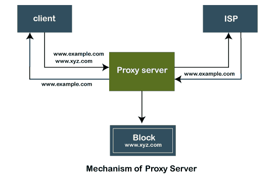
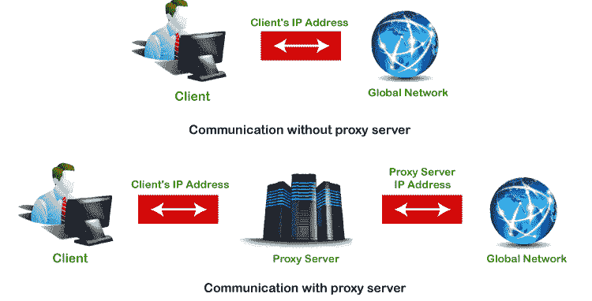
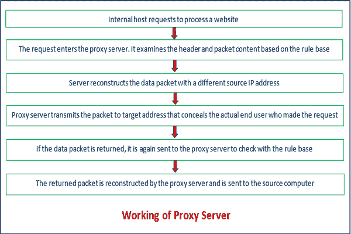

# 什么是代理服务器，它是如何工作的？

> 原文：<https://www.javatpoint.com/what-is-a-proxy-server-and-how-does-it-work>

每台连接到网络的计算机都有一个唯一标识设备的 [IP](https://www.javatpoint.com/ip) (互联网协议)地址。类似地，**代理服务器**是网络上有自己的 IP 地址的计算机。但有时，我们想访问那些被限制的网站或服务器，我们不想显示我们的身份(IP 地址)。在这样的场景下，**代理服务器**应运而生。我们可以通过使用**代理服务器**来实现同样的目的。它提供不同级别的功能、安全性和隐私，具体取决于公司的用例、需求或策略。在本节中，我们将讨论**什么是代理服务器**，其**的类型、优点、需要**，以及代理服务器的**工作。**

## 代理服务系统

**代理服务器**是互联网上的一台计算机，它接受来自客户端的传入请求，并将这些请求转发到目的服务器。它是终端用户和互联网之间的网关。它有自己的 IP 地址。它将客户系统和网络服务器与全球网络分开。

换句话说，我们可以说代理服务器允许我们访问任何具有不同 [IP 地址](ip-address)的网站。它在用户和目标网站或服务器之间起着中介作用。它收集并提供与用户请求相关的信息。关于[代理服务器](https://www.javatpoint.com/best-proxy-servers)最重要的一点是，它不**加密流量**。

代理服务器有两个主要用途:

*   以保持系统的匿名性。
*   通过缓存加速对资源的访问。

## 代理服务器机制

下图描述了代理服务器的机制。

代理服务器接受来自客户端的请求，并根据以下条件生成响应:

1.  如果请求的数据或页面已经存在于本地缓存中，代理服务器本身将向客户端提供所需的检索。
2.  如果本地缓存中不存在请求的数据或页面，代理服务器会将该请求转发给目标服务器。
3.  代理服务器将回复传输到客户端，并缓存到客户端。

因此，可以说代理服务器既是[服务器](https://www.javatpoint.com/server)又是客户端。

## 代理服务器的类型

有许多类型的代理服务器可用。最常见的两种代理服务器是**转发**和**反向代理服务器**。另一个代理服务器有自己的特点和优势。让我们详细讨论每一个。

1.  **开放或转发代理服务器:**这是客户最广泛认可的中介工作者类型。开放式或前向代理服务器指的是那些从 web 客户端获取需求，然后仔细查看目的地以收集所提到的信息的中介。从网站收集数据后，它直接将数据转发给互联网用户。它绕过了当局设置的防火墙。下图显示了前向代理配置。
    T3】
2.  **反向代理服务器:**是安装在多个其他内部资源附近的代理服务器。它以客户端不直接通信的方式验证和处理事务。最受欢迎的反向代理是**清漆**和**鱿鱼**。下图显示了反向代理配置。
    
3.  **拆分代理服务器:**它实现为安装在两台不同计算机上的两个程序。
4.  **透明代理:**它是一个代理服务器，除了代理身份验证和识别所需的内容之外，不会修改请求或响应。它在 80 号口工作。
5.  **非透明代理人:**是一个改变邀约反应的中介，为客户提供一些额外的帮助。网络需求直接从中间人那里运出，从他们开始的地方向工人支付很少的费用。
6.  **敌对代理:**用于窃听客户端机器与 web 之间的数据流。
7.  **拦截代理服务器:**它将代理服务器和网关结合在一起。它通常用于企业，以防止规避可接受的使用政策和便于管理。
8.  **强制代理服务器:**是拦截和非拦截策略的组合。
9.  **缓存代理服务器:**缓存是在先前请求中保存的内容的帮助下为客户端的请求提供服务，而不与指定的服务器通信。
10.  **网络代理服务器:**面向万维网的代理被称为网络代理服务器。
11.  **匿名代理:**服务器试图匿名上网。
12.  **Socks 代理:**是 ITEF(互联网工程任务组)标准。它就像一个支持代理感知应用的代理系统。它不允许外部网络组件收集生成请求的客户端的信息。它由以下组件组成:
    *   SOCK 的一个 dient 库。
    *   诸如[文件传输协议](https://www.javatpoint.com/computer-network-ftp)、[远程登录](https://www.javatpoint.com/computer-network-telnet)或互联网浏览器等互联网程序。
    *   指定操作系统的 SOCK 服务器。
13.  **高匿名代理:**请求头中不包含代理服务器类型和客户端 IP 地址的代理服务器。无法跟踪使用代理的客户端。
14.  **旋转代理:**它为连接到它的每个客户端分配一个唯一的 IP 地址。它非常适合那些经常进行网络报废的用户。它允许我们一次又一次地返回同一个网站。因此，使用旋转代理需要更多的关注。
15.  **SSL 代理服务器:**它对客户端和服务器之间的数据进行解密。这意味着数据是双向加密的。因为代理对客户端和服务器都隐藏了它的存在。它最适合于增强威胁防护的组织。在 SSL 代理中，加密的内容不会被缓存。
16.  **共享代理:**一个共享代理服务器一次被多个用户使用。它为客户端提供了一个可以与其他客户端共享的 IP 地址。它还允许用户选择用户想要搜索的位置。对于不想在快速连接上花很多钱的用户来说，它是理想的选择。低成本是它的一个优点。它的缺点是用户可能会因为别人的恶意行为而受到指责。因此，可以阻止用户访问该网站。
17.  **公共代理:**免费提供公共代理。对于用户来说，它是完美的，因为成本是主要考虑因素，而[安全性](https://www.javatpoint.com/computer-network-security)和速度则不是。它的速度通常很慢。使用公共代理将用户置于高风险之中，因为信息可以被互联网上的其他人访问。
18.  **住宅代理:**它为特定设备分配一个 IP 地址。客户端通过该设备发出的所有请求。它非常适合想要验证网站上显示的广告的用户。使用住宅代理服务器，我们可以阻止竞争对手不需要和可疑的广告。与其他代理服务器相比，住宅代理服务器更可靠。
19.  **扭曲代理:**它和其他的不一样，因为它把自己当成一个网站的代理，却隐藏了自己的身份。由于提供了不正确的 IP 地址，实际的 IP 地址发生了变化。这是完美的客户谁不想透露自己的位置在冲浪。
20.  **数据中心代理:**是不隶属于 ISP 的一种特殊类型的代理。它由其他公司通过数据中心提供。这些服务器可以在物理数据中心找到。它非常适合想要快速响应的客户。它不提供高级别匿名。因此，它会使客户信息面临高风险。
21.  **HTTP 代理:** [HTTP](https://www.javatpoint.com/computer-network-http) 代理是那些用于保存浏览网站缓存文件的代理服务器。它节省时间并提高速度，因为缓存的文件驻留在本地内存中。如果用户再次想要访问相同的文件，代理本身会提供相同的文件，而无需实际浏览页面。

## 代理服务器的优势

使用代理服务器有以下好处:

*   提高了安全性，增强了用户的[隐私](https://www.javatpoint.com/computer-network-privacy)。
*   它隐藏了用户的身份(IP 地址)。
*   它控制交通，防止撞车。
*   此外，通过缓存文件和压缩传入流量来节省带宽。
*   保护我们的网络免受恶意软件的攻击。
*   允许访问受限内容。

## 代理服务器的需求

*   它减少了数据泄露的机会。
*   它在服务器和外部流量之间增加了一个辅助安全层。
*   它还可以防御黑客。
*   它过滤请求。

## 代理服务器的工作

正如我们上面讨论的，代理服务器有自己的 IP 地址，它作为客户端和互联网之间的网关。客户端的计算机知道代理服务器的 IP 地址。当客户端在互联网上发送请求时，请求会被重新路由到代理。之后，代理服务器从目的地或目标服务器/站点获得响应，并将数据从页面转发到客户端的浏览器(Chrome、Safari 等)。).

总体而言，可以说代理服务器代表客户端访问目标站点，收集所有请求的信息，并将其转发给用户(客户端)。下图清楚地描述了代理服务器的工作方式。

## 代理服务器与虚拟专用网

代理服务器和虚拟专用网非常相似。两者都允许客户端隐藏其 IP 地址和位置，并允许访问受限网站。唯一的区别是代理服务器不加密流量，而虚拟专用网也是如此。另一个区别是，没有人可以跟踪虚拟专用网用户的活动，而代理服务器用户的活动可以跟踪。

下表描述了代理服务器和虚拟专用网之间的主要区别。

| 比较的基础 | 代理服务系统 | 虚拟专用网络 |
| **加密** | 它不加密流量。 | 它对流量进行加密。 |
| **软件** | 它没有自己的软件。 | 它有自己的软件。 |
| **速度** | 它比 VPN 更快。 | 与代理服务器相比，它更慢。 |
| **缓存** | 它使用缓存。 | 它不使用缓存。 |
| **IP 地址** | 它隐藏了 IP 地址，但代理所有者可以看到客户端的 IP 地址。 | IP 地址完全隐藏。 |
| **连接** | 它不稳定。 | 它是无缝的。 |
| **定价** | 大部分是免费的。 | 这是收费的。 |
| **可靠性** | 它的连接更频繁地断开。 | 它的连接更可靠。 |
| **工作水平** | 它在应用程序级别工作。 | 它在操作系统级别工作。 |
| **安全** | 它不太安全。 | 它提供了更高的安全性。 |

* * *