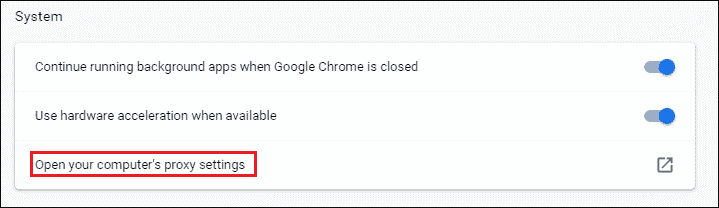
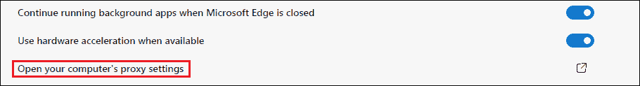
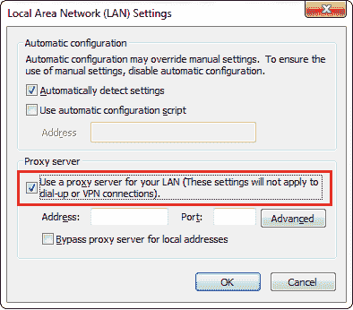
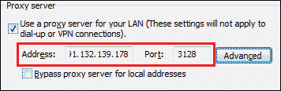
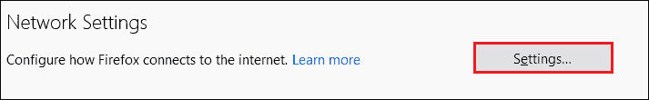
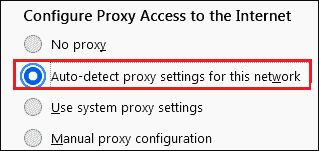
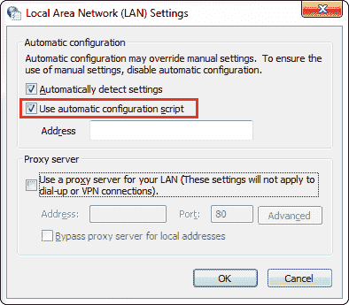
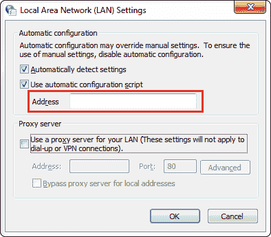
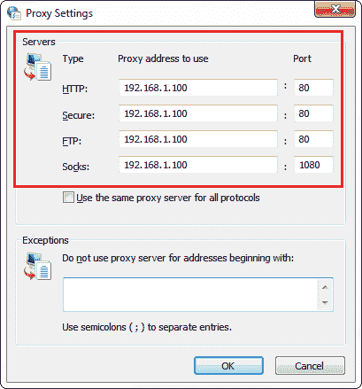
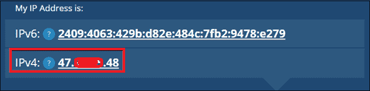

# 如何设置和使用代理服务器？

> 原文：<https://www.javatpoint.com/how-to-set-up-and-use-a-proxy-server>

一个**代理服务器**作为计算机和互联网之间的桥梁。它让互联网变得更快，也提供了更多的安全性和隐私。在这一节中，我们将学习**如何在视窗电脑和浏览器中设置代理服务器**。另外，我们将学习**如何使用代理服务器。**

[](https://bit.ly/2VhJhyD)

## 如何设置代理服务器？

在[窗口 10](https://www.javatpoint.com/what-is-windows) 中，默认自动检测代理设置。我们也可以手动设置**代理**。设置代理的基本方法是使用应该由组织的网络管理员维护的脚本地址。另一种方法是设置自动配置脚本。让我们看看如何在 Windows 和浏览器中设置[代理服务器](https://www.javatpoint.com/what-is-a-proxy-server-and-how-does-it-work)。

### 在 Internet Explorer 中设置代理服务器

像其他浏览器一样，internet explorer 也使用默认的 Windows 代理配置。让我们看看台阶。

1.  打开**互联网浏览器。**
2.  点击右上角的**工具**图标。
    T3】
3.  从菜单中选择**互联网选项**。它会打开一个对话框。
    T3】
4.  在对话框中，点击**连接**选项卡。
    T3】
5.  点击**局域网设置**按钮。
    T3】
6.  在**代理服务器**标签下，勾选**为你的局域网**使用代理服务器，如下图所示。
    
7.  提供您要使用的代理服务器的**地址**和**端口**。在我们的案例中，我们提供了地址**91.132.139.178**，其港口为 **3128。**可以选择不同的。
    
8.  点击**确定**按钮保存设置。
    T3】

全部完成！我们已经设置了代理服务器。现在我们可以匿名上网了。

### 在谷歌浏览器中设置代理服务器

默认情况下，Chrome 使用 Windows 代理和 macOS。如果我们想更改代理设置，请按照下面给出的步骤操作。

1.  打开 **Chrome** 浏览器。
2.  点击右上角的**三个点**。
    T3】
3.  从菜单中选择**设置**选项。它会打开 chrome 设置页面。
    T3】
4.  向下滚动页面，点击**高级**选项。
    T3】
5.  再次，向下滚动页面，点击**打开您电脑的代理设置**，该设置显示在**系统**标签下。打开**互联网属性**对话框。
    
6.  在对话框中，点击**连接**选项卡。
    T3】
7.  点击**局域网设置**按钮。
    T3】
8.  在**代理服务器**标签下，勾选**为你的局域网**使用代理服务器，如下图所示。
    
9.  提供您要使用的代理服务器的**地址**和**端口**。在我们的案例中，我们提供了地址**91.132.139.178**，其港口为 **3128。**可以选择不同的。
    
10.  点击**确定**按钮保存设置。
    T3】

全部完成！我们已经设置了代理服务器。现在我们可以匿名上网了。此外，我们观察到只有几个步骤要在浏览器中执行，然后在您机器的操作系统中执行。

### 在边缘浏览器中设置代理服务器

**微软 Edge** 是 Windows 10 内置的网页浏览器。在我们不告诉它代理之前，它使用的是 Windows 代理配置。它与 Chrome 相同，因此代理配置相似。让我们看看在微软边缘浏览器中设置代理服务器的步骤。

1.  打开**微软 Edge** 浏览器。
2.  点击右上角的**三个点**。
    T3】
3.  从菜单中选择**设置**选项。它会打开“边缘设置”页面。
    T3】
4.  点击左窗格中的**系统**选项。
    T3】
5.  点击**打开你电脑的代理设置**，显示在**系统**标签下。打开**互联网属性**对话框。
    
6.  在对话框中，点击**连接**选项卡。
    T3】
7.  点击**局域网设置**按钮。
    T3】
8.  在**代理服务器**标签下，勾选**为你的局域网**使用代理服务器，如下图所示。
    
9.  提供您要使用的代理服务器的**地址**和**端口**。在我们的案例中，我们提供了地址**91.132.139.178**，其港口为 **3128。**可以选择不同的。
    
10.  点击**确定**按钮保存设置。
    T3】

全部完成！我们已经设置了代理服务器。现在我们可以匿名上网了。此外，我们观察到只有几个步骤要在浏览器中执行，然后在您机器的操作系统中执行。

### 在火狐中设置代理服务器

像其他浏览器一样，火狐不使用系统的默认代理设置。如果我们想在火狐中使用代理，我们应该遵循下面给出的步骤。

1.  打开**火狐**浏览器。
2.  点击右上角的**三条横线**。
    T3】
3.  选择**选项**菜单。
    T3】
4.  向下滚动页面，转到**网络设置。**点击**设置？**按钮。打开**连接设置**对话框。
    
5.  The dialog box shows the multiple options for **configuring proxy access to the internet** are as follows:
    *   **无代理:**如果选中，则不设置代理。
    *   **自动检测该网络的代理设置:**该选项自动检测您正在使用的网络的代理设置。
    *   **使用系统代理设置:**使用操作系统代理设置。
    *   **手动代理配置:**通过选择部分，我们可以通过提供 HTTP、HTTPS、FTP Proxy 以及对应的**端口手动设置代理。**

    在我们的案例中，我们选择了选项**自动检测该网络的代理设置。**

    
6.  选择以上任一选项后，点击**确定**按钮保存设置。
    T3】

全部完成！我们已经设置了代理服务器。现在我们可以匿名上网了。

### 在窗口中设置代理服务器:自动

在 Windows 中自动设置代理服务器包括以下步骤:

1.  打开**控制面板。**
2.  选择**互联网选项。**打开互联网选项对话框。
    T3】
3.  在对话框中，点击**连接**选项卡。
    T3】
4.  点击**局域网设置**按钮。
    T3】
5.  在**自动配置**标签下，勾选**使用自动配置脚本选项，**如下所示。
    
6.  在地址框中提供指定的**脚本**地址。在我们的例子中，脚本地址是 file://c:/proxy.pac，因为我们已经创建了一个名为 **PROXY 的文件(代理配置文件)。将**(见下图)打包到 **C:\** 目录。您可以选择自己选择的目录。
    
7.  点击**确定**按钮保存设置。
    T3】

全部完成！我们已经设置了代理服务器。现在我们可以匿名上网了。

**PROXY。包装**

浏览器有时需要从保存为**代理的配置文件中获取代理设置。PAC** (其中 PAC 代表代理自动配置)。该文件包含代理设置，但也可以在其他一些情况下使用。例如，负载平衡、容错等。

我们可以对 PROXY 进行任何更改。相应地打包文件。在下面的脚本中，我们看到有多个 URL 被定义为绕过代理，所有其他 URL 都被定义为通过代理。

```

function FindProxyForURL(url, host)
{
   var proxy_yes = "PROXY 213.136.89.121:80";
   var proxy_no = "DIRECT";
   if (shExpMatch(url,  "http://www.demo.com*")) { return proxy_no; }
   if (shExpMatch(url, "http://www.example.com*")) { return proxy_no; }
   // Proxy anything else
   return proxy_yes;   
}

```

创建配置文件后，我们可以继续步骤 6 和 7。

### 在窗口中设置代理服务器:手动

在 Windows 中自动设置代理服务器包括以下步骤:

1.  打开**控制面板。**
2.  选择**互联网选项。**打开互联网选项对话框。
    T3】
3.  在对话框中，点击**连接**选项卡。
    T3】
4.  点击**局域网设置**按钮。
    T3】
5.  在**代理服务器**标签下，勾选**为局域网使用代理服务器**选项，如下图所示。
    
6.  点击**高级**按钮。
    T3】
7.  在**代理设置**对话框中，提供**代理地址** (HTTP、FTP、Secure、Socks)及其要使用的端口。在我们的案例中，我们提供了以下内容:
    
    *   **HTTP 代理:** 192.168.1.100，**端口:** 80
    *   **FTP 代理:** 192.168.1.100，**端口:** 80
    *   **安全代理:** 192.168.1.100，**端口:** 80
    *   **袜子代理:** 192.168.1.100，**港口:** 1080
8.  点击**确定**按钮保存更改。
    T3】

全部完成！让我们检查代理是否工作。

打开浏览器，输入[https://whatismyipaddress.com/](https://whatismyipaddress.com/)。它显示系统的 IP 地址。下图显示了使用代理之前系统的 IP 地址。



当我们设置代理时，系统的 IP 地址将被更改为不同的地址。

## 如何使用代理服务器？

设置代理后，我们可以像以前一样访问互联网。唯一的变化就是系统的 IP 发生了变化。

## 我们应该什么时候使用代理服务器？

如果想要实现以下任何一项，我们应该使用代理服务器:

*   被阻止的互联网协议
*   停止饼干
*   浏览防火墙
*   压缩流量
*   缓存网站
*   移除广告
*   停止恶意软件
*   移除剪裁
*   访问深层网络
*   国际购买
*   访问娱乐

* * *