# 计算机网络基础

> 原文：<https://www.javatpoint.com/fundamentals-of-computer-networking>

本教程将探索计算机网络的定义、类型、计算机网络工作原理、网络概念、常用术语、网络和互联网、工作原理以及网络拓扑。

## 什么是计算机网络？

***“计算机网络定义为两台或多台计算机链接在一起的集合？是通过有线电缆还是无线网络，即 WiFi？目的是交流、交换、共享或分发数据、文件和资源。”*T3】**

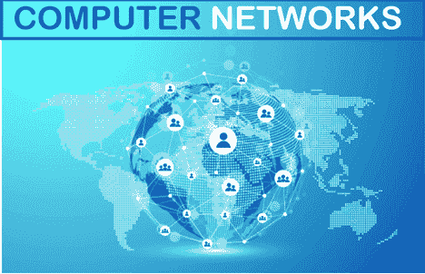

计算机网络由硬件(如路由器、交换机、集线器等)和网络软件(如**操作系统、防火墙或公司应用程序)组成。**

虽然人们也可以根据计算机网络的地理位置来定义它们，但是局域网(局域网)在一个确定的物理维度上连接计算机，例如家庭或办公室内的 T2。

相比之下，**城域网**连接一个城市中多个建筑之间的计算机。

**互联网**是连接全球数十亿网络设备的**广域网**最重要的例子。

人们还可以通过计算机网络的通信协议、网络元素的物理排列、网络流量的管理方式及其功能来描述计算机网络的概念。

商业、娱乐行业、研究领域的教育在全球范围内使用计算机网络进行通信，并将它们的数据从源节点传输到目的节点。

所有其他技术，包括**互联网、谷歌搜索、即时通讯应用、在线视频流、社交媒体、电子邮件、云厨房、云数据存储、**等。，都是因为计算机网络而存在的。

## 计算机网络类型

以下是目前最常用的计算机网络类型:

*   **局域网【局域网】**
*   **无线局域网【无线局域网】**
*   **CAN【校园网】**
*   **城域网**
*   **PAN【个人区域网】**
*   **存储区域网络**
*   **虚拟专用网络**
*   **广域网**

### 1.局域网

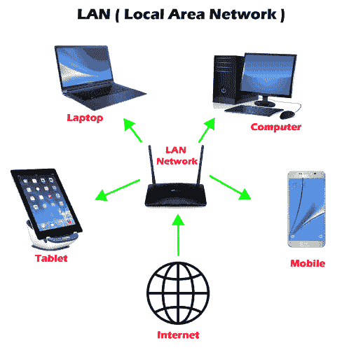

***局域网或局域网*** 是连接计算机和其他设备如**交换机、服务器、打印机、**等的一组设备。，在办公室、家里等短距离内。常用的局域网是**以太网局域网。**使用该网络是因为它允许用户传输或共享数据、文件和资源。

### 2.无线局域网

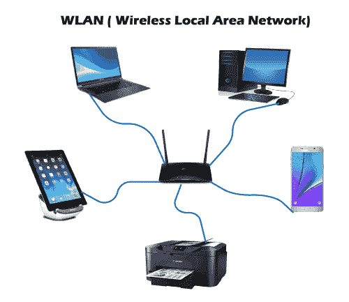

***WLAN 或无线局域网*** 与 LAN 类似，区别在于它使用设备之间的无线通信，而不是有线连接。与智能手机、笔记本电脑、台式机、等不同，无线局域网通常包含一个**无线路由器或设备无线接入点。**

### 3.能

***CAN 或*校园局域网**是一个封闭的企业通信网络。CAN 是一种移动网络，可能包含私有或公共部分。can 被广泛应用于**大学、学院和公司网站。**

### 4.男人

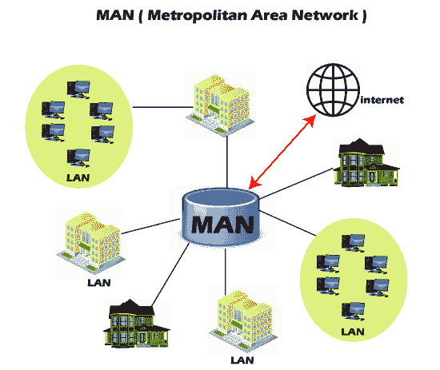

与局域网相比，城域网或城域网是一种更广泛的网络，但比广域网更小。这个网络位于同一城市的几栋建筑之间。城域网通过光缆连接(通常是高速连接)。城市和政府机构通常管理城域网。

### 5.平底锅

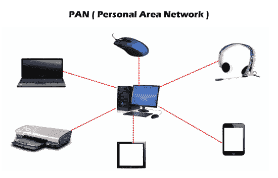

***PAN 或个人区域网*** 是一种个人使用的网络，通常为一个人服务。这种网络通常连接不同于智能手机、笔记本电脑或台式机的设备来同步内容和共享小文件，不同于歌曲、照片、视频、日历等。这些设备通过**无线网络连接，如无线网络、蓝牙、红外线等。**

### 6.疗养院

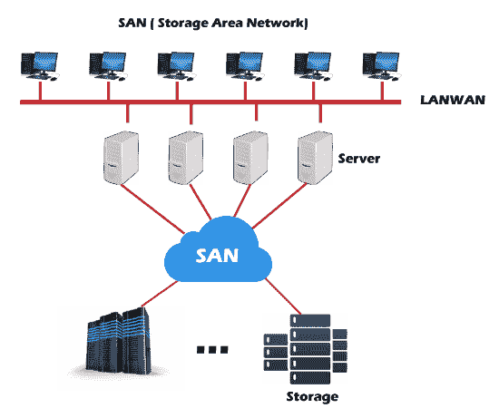

***SAN 或存储区域网络*** 是一个专门的高速网络，用于存储和提供对块级存储的访问。这是一个专用的共享网络，用于云数据存储，看起来和工作起来都像一个存储驱动器。

存储区域网络由各种**交换机、服务器和磁盘阵列组成。**SAN 的优势之一是容错，也就是说如果有任何交换机或服务器发生故障，数据仍然可以访问。

### 7.虚拟专用网络

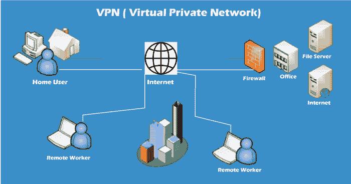

***VPN 或虚拟专用网络*** 是一种安全工具，可对点对点互联网连接进行加密，并隐藏用户的 IP 地址和虚拟位置。它确定了一个加密网络来提高用户的在线隐私，以便黑客无法访问他们的身份和数据。

### 8.广域网

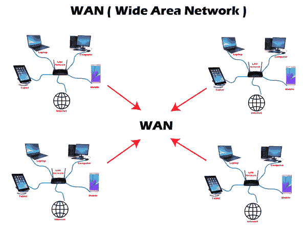

***WAN 或广域网*** 是连接一个国家、大陆等广阔地理区域内的计算机的最重要的网络类型。广域网包括几个局域网、城域网和城域网。广域网的一个例子是**互联网，**连接了全球数十亿台计算机。

## 网络术语和概念

日常网络生活中最常用的一些术语如下所述:

### 1.国际电脑互联网地址

一个 IP 地址或 ***互联网协议*** 是一个**唯一的数字，代表你在互联网上居住的地址。**每个连接到网络的设备都有一串数字或 IP 地址，而不是房屋地址。

您不会发现两个连接到网络的设备具有相同的 IP 地址。当您的计算机向另一台不同的计算机发送数据时，发送的数据包含一个“报头”，该报头进一步包含设备的 IP 地址，即源计算机和目标设备。

### 2.节点

节点是指网络**连接点，在该点，网络内部发生连接，进一步帮助接收、传输、创建或存储文件或数据。**

多个设备可以使用有线或无线节点连接到互联网或网络。要形成网络连接，需要两个或多个节点，其中每个节点携带其唯一的标识来获得访问权限，例如一个 IP **地址。**节点的一些例子是**计算机、打印机、调制解调器、交换机等。**

### 3.路由器

路由器是一种物理网络设备，它在网络之间转发数据包。路由器进行数据分析，在网络上执行流量引导功能，并定义数据包到达目的节点的顶级路由。一个**数据包**可能必须超过网络中的多台路由器，直到到达目的地。

### 4.开关

在计算机网络中，交换机是一种连接其他设备的设备，通过决定在网络中传输数据的最佳方式(通常是在更广泛的网络中有多条路由的情况下)，帮助实现节点到节点的通信。

虽然路由器也传输信息，但它只在网络之间转发信息，而交换机则在单个网络中的节点之间转发数据。

切换进一步分为以下三种类型:

*   **电路切换**
*   **分组交换**
*   **消息切换**

*   **电路交换:**在这种交换类型中，在网络中的节点(或发送方和接收方)之间建立安全的通信路径。在传输数据之前，它会建立一条专用的连接路径，这条路径可以确保良好的传输带宽，并防止任何其他流量在该路径上传输。例如，**电话网。**
*   **分组交换:**利用这种技术，消息被分解成独立的部分，称为分组。由于它们体积小，每个数据包都是单独发送的。通过网络传输的数据包将有它们的源和目的 IP 地址。
*   **消息交换:**这种交换技术使用存储转发机制。它从源节点发送完整的消息单元，从多个交换机传递，直到到达中间节点。它不适合实时应用。

### 5.港口

端口**允许用户通过识别网络设备之间的连接来访问多个应用程序。**每个端口分配一组字符串编号。如果您将 IP 地址与酒店地址相关联，您可以将端口称为酒店房间号。网络设备使用端口号来决定使用哪个应用程序、服务或方法来转发详细信息或数据。

### 6.网线类型

网线被用作不同计算机和其他网络设备之间的**连接介质。**网络电缆类型的典型示例有**以太网电缆、同轴电缆和光纤电缆。**虽然电缆类型的选择通常取决于网络的大小、网络组件的组织以及网络设备之间的距离。

## 计算机网络和互联网

互联网是连接全球数十亿台计算机的广域网的主要例子。互联网遵循标准协议，便于这些网络设备之间的通信。这些协议包括:

1.  **HTTP(超文本传输协议)**
2.  **IP(互联网协议或 IP 地址)**
3.  **传输控制协议**
4.  **UDP(用户数据报协议)**
5.  **文件传输协议**

**ISP(互联网服务提供商)NSPs(网络服务提供商)**有效支撑互联网基础设施。基础设施允许通过互联网将数据包传输到接收设备。

互联网是一个巨大的信息枢纽，但这些信息并没有发送到每一台连接到互联网的计算机上。协议和基础设施负责管理共享用户请求的精确信息。

## 它们是如何工作的？

1.  **计算机网络是借助有线电缆(以太网、数据电缆、光纤)或无线网络(蓝牙、Wi-Fi)连接计算机、台式机、路由器、集线器和交换机等多个节点**而形成的。这种网络连接使节点能够通过网络进行通信和交换数据。
2.  网络**遵循通信协议发送、接收、创建或转发数据。**与网络连接的每个笔记都被分配了一个唯一的 IP(互联网协议)，该 IP 地址用于识别一个设备，并使其他设备能够识别它。
3.  **路由器和交换机是支持和管理网络间通信**的虚拟或物理介质。路由器检查数据包以得出最佳路由，然后数据可以很容易地到达目的节点。相比之下，如果在更广泛的网络中有多条路由，交换机会连接这些设备，并促进节点到节点的通信，从而确保通过网络传输的数据包到达目的节点。

## 网络拓扑结构

**“网络拓扑被定义为计算机或计算机网络的节点的排列，以建立所有节点之间的通信。”**

节点是指能够传输、接收、创建或存储信息的设备。这些节点通过有线(电缆、以太网)或无线(蓝牙、无线)网络连接。

为了帮助在不同情况下构建成功的网络，拓扑进一步分为几种类型。
虽然有几种拓扑，但在本教程中，我们将讨论常用的拓扑，如下所示:

### 1.总线拓扑

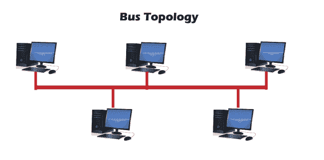

*   A ***总线网络拓扑*** 支持公共传输介质，其中每个节点都与主网线直接相连。
*   数据通过主网络电缆传输，并由所有节点同时接收。
*   通过源机器产生一个信号，其中包含接收机器的地址。信号在两个方向上传播到连接到总线网络的所有节点，直到到达目的节点。
*   总线拓扑不容错，并且电缆长度有限。

### 2.环形拓扑

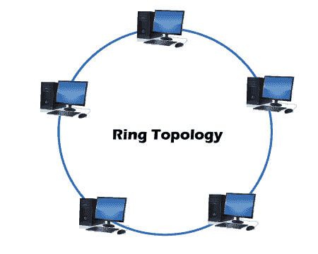

*   A ***环形拓扑*** 是总线拓扑的修改版本，其中每个节点以闭环形式连接，形成对等局域网拓扑。
*   环形拓扑中的每个节点恰好有两个连接。相邻节点对直接连接，而非相邻节点通过各种节点间接连接。
*   环形拓扑支持单向通信模式，其中数据的发送和接收通过 **TOKEN 进行。**

### 3.星形布局

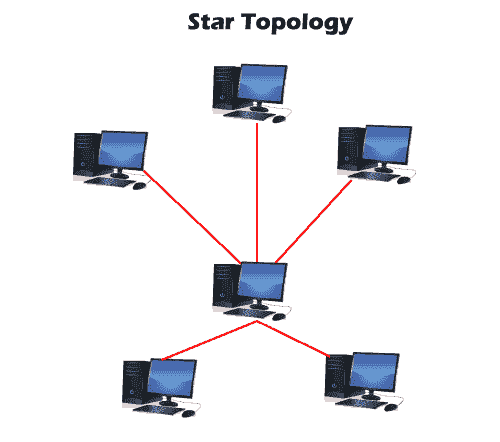

*   在 ***星形网络拓扑中，*** 每个节点使用单个中心集线器或交换机连接。
*   集线器或交换机执行整个集中管理。每个节点将其数据发送到集线器，然后集线器将接收到的信息共享给目的设备。
*   两个或多个星形拓扑可以在中继器的帮助下相互连接。

### 4.网状拓扑

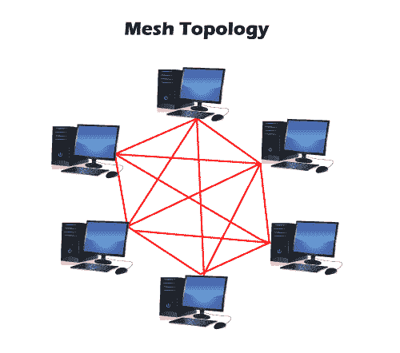

*   在 ***网状拓扑中，*** 网络连接中的每个节点直接相互连接，在节点之间形成重叠连接。
*   这种拓扑提供了更好的容错能力，因为如果任何网络设备出现故障，它都不会影响网络，因为其他设备可以传输信息。
*   网状网络能够自我配置和自我组织，找到最快、最安全的数据传输方式。
*   通过将网络中的每个节点连接到另一个节点，可以形成全网状拓扑。**全网状**价格昂贵，仅用于要求高数据冗余的网络。
*   另一种类型的网状拓扑是**部分网状拓扑，**只有少数设备连接，很少设备连接到它们共享最多信息的设备。这种网状类型适用于网络，需要较少的冗余或易于执行的经济高效的网络拓扑。

* * *