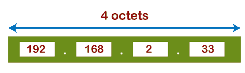
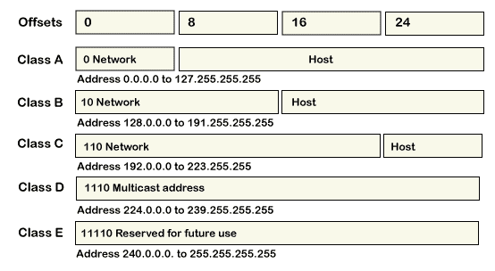
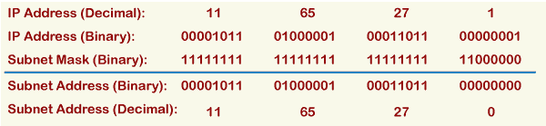
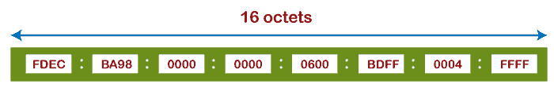

# IP 地址格式和表格

> 原文：<https://www.javatpoint.com/ip-address-format-and-table>

IP 地址是“互联网协议地址”的简称它是一个唯一的号码，提供给每一个连接到互联网的设备，如安卓手机、笔记本电脑、苹果电脑等。一个 IP 地址用一个整数表示，用一个点(。)，比如 192.167.12.46。

## IP 地址的类型

根据包含的 IP 地址数量，IP 地址分为两种不同的类型。这些是:

*   IPv4(互联网协议版本 4)
*   IPv6(互联网协议版本 6)

### 什么是 IPv4？

IPv4 是 IP 的第 4 版。是当前版本，也是最常用的 [IP](https://www.javatpoint.com/ip) 地址。它是一个 32 位地址，由四个数字组成，用点(。)，即周期。该地址对于每个设备都是唯一的。例如，66.94.29.13

### 什么是 IPv6？

IPv4 产生 40 亿个地址，开发者认为这些地址足够了，但他们错了。IPv6 是下一代 IP 地址。IPv4 和 IPv6 的主要区别在于 IP 地址的地址大小。IPv4 是 32 位地址，而 IPv6 是 128 位十六进制地址。IPv6 提供了很大的地址空间，与 IPv4 相比，它包含一个简单的报头。

想了解更多关于 IPv4 和 IPv6 的区别，请看我们的文章 [ipv4 对比 ipv6](https://www.javatpoint.com/ipv4-vs-ipv6) 。

## IP 地址格式

最初，IP 地址被分为五个不同的类别，称为**类**。这些划分的 IP 类有 A 类、B 类、C 类、D 类、e 类，其中 A 类、B 类、C 类最重要。每个地址类为其**网络前缀(网络地址)**和**主机号(主机地址)**定义不同的位数。起始地址位决定地址属于哪一类。

**网络地址:**网络地址指定分配给您的网络的唯一号码。在上图中，网络地址占用两个字节的 IP 地址。

**主机地址:**主机地址是分配给每台主机的特定地址号。借助主机地址，可以在网络中识别每台机器。网络中每台主机的网络地址都是相同的，但主机地址必须不同。

### 地址格式 IPv4

IPv4 的地址格式表示为**4-八位字节** (32 位)，分为三个不同的类，即 A 类、B 类和 c 类。

上图显示了 IPv4 的地址格式。IPv4 是一个 32 位十进制地址。它包含由“点”分隔的四个八位字节或字段，每个字段的大小为 8 位。每个字段包含的数字应该在 0-255 的范围内。

### 甲级

**A 类**地址仅使用第一个高阶八位字节(字节)来标识网络前缀，其余三个八位字节(字节)用于定义各个主机地址。A 类地址的范围在 0.0.0.0 到 127.255.255.255 之间。第一个八位字节的第一位总是设置为 0(零)，接下来的 7 位确定网络地址，其余 24 位确定主机地址。所以第一个八位字节的范围是从 0 到 127 (00000000 到 01111111)。

### 乙类

**B 类**地址使用前两个八位字节(两个字节)标识网络前缀，其余两个八位字节(两个字节)定义主机地址。B 类地址的范围在 128.0.0.0 到 191.255.255.255 之间。第一个高位八位字节的前两位始终设置为 10(一位和零位)，接下来的 14 位确定网络地址，其余 16 位确定主机地址。所以第一个八位字节的范围是 128 到 191 (10000000 到 10111111)。

### 丙类

**C 类**地址使用前三个八位字节(三个字节)标识网络前缀，剩余的最后一个八位字节(一个字节)定义主机地址。C 类地址的范围在 192.0.0.0 到 223.255.255.255 之间。第一个八位字节的前三位始终设置为 110，接下来的 21 位指定网络地址，其余 8 位指定主机地址。它的第一个八位字节的范围是 192 到 223 (11000000 到 11011111)。

### D 类

**D 类** IP 地址为组播地址预留。第一个二进制八位数的前四位总是设置为 1110，其余位决定了任何 IP 地址中的主机地址。第一个较高的八位字节位总是设置为 1110，其余位指定主机地址。D 类地址的范围在 224.0.0.0 到 239.255.255.255 之间。在多播中，数据不被分配给任何特定的主机，因此不需要从 IP 地址中找到主机地址，并且在 d 类中也不存在子网掩码

### E 级

**E 类** IP 地址留作实验用途和未来使用。它不包含任何子网掩码。第一个较高的二进制八位数总是设置为 1111，下一个剩余的位指定主机地址。E 类地址范围在 240.0.0.0 到 255.255.255.255 之间。

在每个 IP 地址类别中，所有主机编号位都由 2 的幂指定，表示可以为特定网络地址创建的主机地址的总数。A 类地址最多可包含 2 24 (16，777，216)个主机号。B 类地址最多包含 2 个 16 个 (65，536)主机号。C 类最多包含 2 个 8 个 (256)主机号。

**IP 地址的子网地址，用一个例子来理解:**

假设 A 类地址是 11.65.27.1，其中 11 是网络前缀(地址)，65.27.1 指定网络上的特定主机地址。假设网络管理员希望使用 23 到 6 位来标识子网，剩余的 5 到 0 位来标识主机地址。它可以在*子网掩码*中用 31 到 6 的所有 1 位表示，其余(5 到 0)用 0 位表示。

子网掩码(二进制):1111 11111111 11111111 1100000

IP 地址(二进制):00001011 01000001 00011011 00000001

现在，可以通过在完整的 IP 地址和子网掩码之间应用 AND 运算(1+1=1，1+0=0，0+1=0，0+0=0)来计算子网。结果是:

00001011 01000001 00011011 00000000 = 11 . 65 . 27 . 0 子网地址

### IP 地址格式 IPv6

所有 IPv6 地址都是 128 位十六进制地址，写入 8 个独立的部分，每个部分都有 16 位。由于 IPv6 地址是以十六进制格式表示的，因此它们的部分范围从 0 到 FFFF。每个部分由冒号(:)分隔。它还允许删除每个 16 位部分的起始零(0)。如果两个或多个 16 位连续部分包含全零(0 : 0)，则可以使用双冒号(::)压缩它们。

IPv6 地址由 8 个不同的部分组成，每个部分都有一个由冒号(:)分隔的 16 位十六进制值。IPv6 地址表示为以下格式:

xxxx : xxxx : xxxx : xxxx : xxxx : xxxx : xxxx : xxxx

每个“xxxx”组包含一个 16 位十六进制值，每个“x”是一个 4 位十六进制值。例如:

FDEC : BA98 : 0000 : 0000 : 0600 : BDFF : 0004 : FFFF

您还可以删除每个 16 位部分的起始零(0)。例如，可以通过省略起始零(0)来重写上述 IPv6，如下所示:

FDEC : BA98 : 0 : 0 : 600 : BDFF : 4 : FFFF

您也可以使用双冒号(::)压缩连续的 16 位零(0 : 0)部分。但是请记住，每个 IP 地址只能执行一次。

FDEC : BA98 : : 600 : BDFF : 4 : FFFF

## IP 地址表

根据范围，IP 地址分为五个地址类别，如下所示。

| 班级 | 高位 | 网络地址位 | 主机地址位 | 网络数量 | 每个网络的主机数量 | 范围 |
| A | Zero | eight | Twenty-four | 2 7 | 2 24 | 0.0.0.0 至 125.255.255.255 |
| B | Ten | Sixteen | Sixteen | 2 14 | 2 16 | 128.0.0.0 至 191.255.255.255 |
| C | One hundred and ten | Twenty-four | eight | 2 21 | 2 8 | 192.0.0.0 至 223.255.255.255 |
| D | One thousand one hundred and ten | 未定义并为将来保留 | 未定义并为将来保留 | 未定义并为将来保留 | 未定义并为将来保留 | 224.0.0.0 至 239.255.255.255 |
| E | One thousand one hundred and eleven | 未定义并为将来保留 | 未定义并为将来保留 | 未定义并为将来保留 | 未定义并为将来保留 | 240.0.0.0 至 255.255.255.255 |

* * *