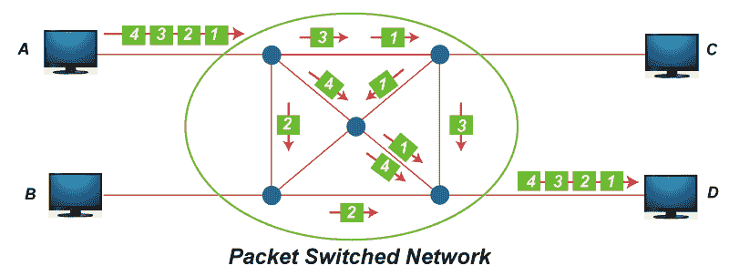
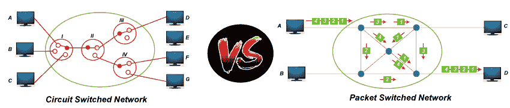

# 电路交换和分组交换的区别？

> 原文：<https://www.javatpoint.com/circuit-switching-vs-packet-switching>

本文将学习电路交换和分组交换的区别。两者都是交换技术的类型。首先，我们将学习交换网络技术的一些基础知识。之后，我们会看到两者之间的差异。

## 电路交换网络:

电路交换网络是最简单的数据通信方法之一，其中在发送和接收设备之间建立专用路径。在这种情况下，物理链路通过一组交换机连接。

**下图显示了电路交换网络的工作情况。**

在上图中，它显示了一个电路交换网络，其中计算机通过 4 个具有点对点连接的交换机进行连接。

## 分组交换网络:

在分组交换网络中，消息被分成分组。每个数据包都包含一个报头，其中包括源地址、目的地址和控制信息。

**下图显示了分组交换网络的工作情况。**

在上图中，它显示了如何使用数据图方法将四个数据包从站点 A 传送到站点 d。

### 以下是电路交换和分组交换网络之间的区别。

| S.No | 参数 | 切换网络电路 | 报文分组交换网络 |
| one | 小路 | 在电路交换网络中，通过设置开关在两点之间创建专用路径。 | 在分组交换网络中，两点之间不创建专用路径。只有虚电路存在。 |
| Two | 存储和转发传输 | 在电路交换中，没有存储和转发传输的概念。 | 在虚拟分组交换网络中，每个节点可以存储传入的分组，并在使用后转发它们。 |
| three | 专注的 | 电路交换网络中构成路径的链路是专用的，不能用于其他连接。 | 在虚电路网络中，形成路由的链路可以专用于其他连接。 |
| four | 带宽的可用性 | 在电路交换中，带宽是固定的，因为它是预先预留的。 | 在虚拟电路网络中，所需带宽是动态的，因为它可以根据需要释放。 |
| five | 数据包遵循的路由 | 数据包遵循的路由总是相同的。 | 数据包遵循的路由可能不同，也可能不同。 |
| six | 呼叫建立 | 需要电路内交换呼叫设置。 | 在分组交换中，不需要呼叫建立。 |
| seven | 拥挤 | 在电路交换中，拥塞可能在建立时发生。 | 在分组交换中，每个分组都会发生拥塞。 |
| eight | 带宽浪费 | 在电路交换中，带宽是固定的，分配电路上未使用的带宽被浪费了。 | 来自不相关源的其他数据包可能会利用未使用的带宽。 |
| nine | 充电 | 在电路交换中，用户是根据时间和距离收费的。 | 在分组交换中，用户的收费是基于时间和承载的字节数，而不是基于距离。 |
| Ten | 应用 | 用于双向、实时传输语音信号的电话网络。 | 计算机间数据报和可靠流服务的因特网。 |
| Eleven | 层 | 电路交换网络是在物理层实现的。 | 虚拟电路网络在数据链路和网络层实现。 |
| Twelve | 可靠性 | 电路交换非常可靠。 | 在分组交换中，可靠性低，易受拥塞影响。 |
| Thirteen | 开销位 | 在电路交换网络中，呼叫建立后没有开销位。 | 在分组交换中，每个分组中的开销位。 |
| Fourteen | 技术或类型 | 电路交换采用两种技术

 | 使用两种技术的分组交换

*   Datagram circuit method
*   Virtual circuit method

 |
| Fifteen | 设备费 | 电路交换的初始成本很低。 | 分组交换网络的安装成本很高。 |
| Sixteen | 协议 | 电路交换需要简单的传输协议。 | 分组交换需要复杂的协议来传送。 |
| Seventeen | 寻址方案 | 在电路交换中，使用分层编号方案。 | 在分组交换中，使用分层地址空间。 |
| Eighteen | 终端终端 | 在这种情况下，电话和调制解调器用作终端。 | 在这种情况下，计算机被用作终端。 |
| Nineteen | 信息类型 | 该信息类型为
模拟语音或 PCM 数字语音。 | 在这种信息类型中是二进制信息。 |
| Twenty | 多路复用方案 | 在电路交换中，使用电路多路复用。 | 在分组交换中，使用分组多路复用的共享媒体接入网。 |
| Twenty-one | 路由方案 | 在电路交换中，设置期间的路由选择。 | 在分组交换中，每个分组都是独立路由的。 |

* * *