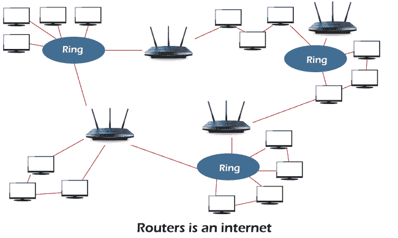
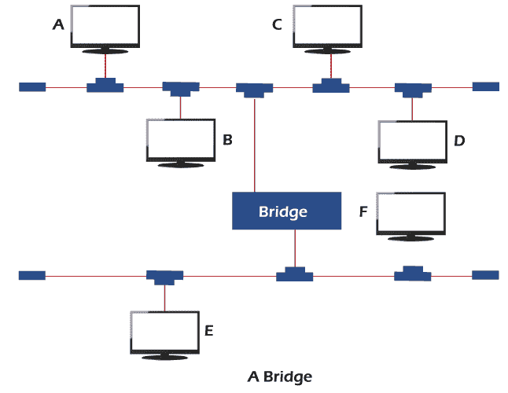
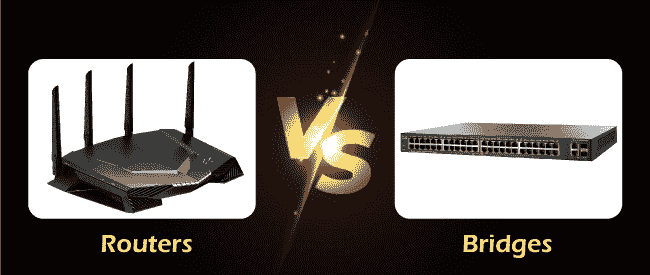

# 路由器和网桥的区别

> 原文：<https://www.javatpoint.com/router-vs-bridge>

在本文中，我们将详细了解路由器和网桥网络设备之间的区别。

### 路由器:

它是一个互连设备，工作在现场视察参考模型的物理、数据链路和网络层。它可以连接网络中的局域网和广域网，并可以在它们之间传递或中继数据包。它可以访问网络或逻辑地址。下图显示了路由器在网络中的作用。

在这种情况下，路由器同时是多个网络的成员。它们与两个或多个网络相连，并包含所有这些网络上站点的地址。它从一个连接的网络接收数据包，并将它们传递到另一个连接的网络。如果接收到的数据包包含某个其他网络上的节点的地址，路由器将确定哪个连接的网络是该数据包的下一个最佳中继点。

## 桥

网桥是在网络的物理层和数据链路层都工作的网络设备。这种设备可以将一个大网络分成更小的网段，并在两个原本分开的局域网之间传递帧。网桥维护着与其相连的各个站点的媒体访问控制地址。当帧进入网桥时，它会检查帧中包含的地址，并将其与两个网段上所有站点的表进行比较。

**例如，**一个帧从站 A 发送到站 C。当这个帧到达网桥时，网桥检查它的表并阻止它进入下段，因为站 C 只在上段。因此，帧被中继到整个上段，并且不允许移动到下段。如果帧要从站 A 传输到站 F，网桥将允许该帧通过，并将其中继到整个下段。

**以下是路由器和网桥之间的点对点比较。**

| -你好。不，不 | 分歧点 | 路由器 | 桥 |
| **1** | **功能** | 主要功能是路由数据包和减少网络问题。 | 网桥的主要功能是过滤数据包，并分别保持每个网段的流量。 |
| **2** | **层** | 它是在现场视察模型的网络、数据链路和物理层工作的硬件设备。 | 它是在现场视察模型的数据链路和物理层工作的硬件设备。 |
| **3** | **地址** | 路由器可以访问站点的逻辑地址或 IP 地址。 | 网桥可以访问站点的物理地址或媒体访问控制地址。 |
| **4** | **协议** | RIP、OSPF 等。这些是可以在路由器中配置的一些协议。 | 在网桥中，没有要配置的协议。 |
| **5** | **连接** | 它连接两个或多个网络，并在它们之间路由数据包。 | 网桥用于扩展现有网络或将大型网络划分为更小的网段。 |
| **6** | **路由表** | 路由器使用路由表来存储信息。该表是动态的，使用路由协议进行更新。 | 网桥不使用路由表来存储信息。 |
| **7** | **数据结构** | 路由器采用图形数据结构。 | 桥使用表格数据结构 |
| **8** | **网络细分** | In 路由器支持网络分段。 | 在网桥中，网络分段被禁用。 |
| **9** | **域** | 它不仅适用于单个广播域。 | 网桥在单个广播域上工作。 |
| **10** | **透明度** | 它对终端站不透明。 | 它对终端站是透明的，不依赖于协议。 |
| **11** | **效率** | 路由效率更高。 | 网桥的效率低于路由器。 |
| **12** | **港口** | 它有两个以上的端口。 | 它只有两个端口。 |
| **13** | **路径** | 路由器设备可以容纳多条路径。 | 桥接设备可以容纳单一路径。 |
| **14** | **设置** | 困难的 | 容易的 |
| **15** | **成本** | 路由器是相对昂贵的设备。 | 桥是相对便宜的设备。 |

* * *