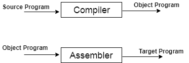

# 编译器简介

> 原文：<https://www.javatpoint.com/compiler-introduction>

*   编译器是将高级语言转换成机器语言的翻译器。
*   高级语言由开发人员编写，机器语言可以被处理器理解。
*   编译器用于向程序员显示错误。
*   编译器的主要目的是改变用一种语言编写的代码，而不改变程序的含义。
*   当你执行一个用 HLL 编程语言编写的程序时，它会分成两部分执行。
*   在第一部分中，源程序被编译并翻译成目标程序(低级语言)。
*   第二部分，目标程序通过汇编器翻译成目标程序。

**图:编译器中源程序的执行过程**