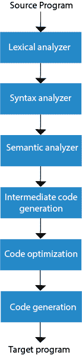

# 编译器阶段

> 原文：<https://www.javatpoint.com/compiler-phases>

编译过程包含不同阶段的顺序。每个阶段以一种表示形式获取源程序，并以另一种表示形式产生输出。每个阶段都从其前一阶段获取输入。

编译器有不同的阶段:

**图:编译器的阶段**

### 词汇分析:

词法分析器阶段是编译过程的第一阶段。它以源代码作为输入。它一次读取一个字符的源程序，并将其转换成有意义的词汇。词法分析器以标记的形式表示这些词。

### 语法分析

语法分析是编译过程的第二阶段。它将令牌作为输入，并生成一个解析树作为输出。在语法分析阶段，解析器检查由标记组成的表达式在语法上是否正确。

### 语义分析

语义分析是编译过程的第三阶段。它检查解析树是否遵循语言规则。语义分析器跟踪标识符、它们的类型和表达式。语义分析阶段的输出是带注释的树语法。

### 中间代码生成

在中间代码生成中，编译器将源代码生成为中间代码。中间代码在高级语言和机器语言之间生成。中间代码应该以这样一种方式生成，即您可以轻松地将其翻译成目标机器代码。

### 代码优化

代码优化是一个可选阶段。它用于改进中间代码，以便程序的输出可以运行得更快，占用更少的空间。它删除了不必要的代码行，并安排了语句序列，以加快程序的执行速度。

### 代码生成

代码生成是编译过程的最后阶段。它将优化的中间代码作为输入，并将其映射到目标机器语言。代码生成器将中间代码转换成指定计算机的机器代码。

**示例:**

