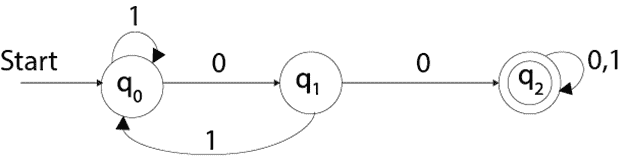
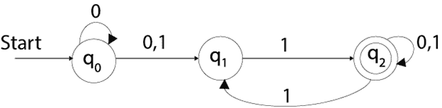

# 有限状态机

> 原文：<https://www.javatpoint.com/finite-state-machine>

*   有限状态机用于识别模式。
*   有限自动机以符号串为输入，并相应地改变其状态。在输入中，当找到所需的符号时，就会发生转换。
*   在转换时，自动机可以移动到下一个状态，也可以保持在同一状态。
*   FA 有两种状态:接受状态或拒绝状态。当输入字符串被成功处理并且自动机达到其最终状态时，它将接受。

### 有限自动机由以下部分组成:

q:有限状态集
∑:有限输入符号集
q0:初始状态
F:最终状态
δ:转换函数

转换函数可以定义为

```

δ: Q x ∑ →Q

```

### FA 有两种特征:

1.  有限自动机
2.  NDFA(非确定有限自动机)

## 美术博士（Doctor of Fine Arts 的缩写）

DFA 代表确定性有限自动机。确定性是指计算的唯一性。在 DFA 中，输入字符只进入一种状态。DFA 不接受空移动，这意味着 DFA 不能在没有任何输入字符的情况下改变状态。

DFA 有五个元组{Q，∞，q0，F，δ}

Q: set of all states
∑: finite set of input symbol where δ: Q x ∑ →Q
q0: initial state
F: final state
δ: Transition function

### 例子

参见确定性有限自动机的示例:

```

Q = {q0, q1, q2}
∑ = {0, 1}
q0 = {q0}
F = {q3}

```



## 掺铌光纤放大器

NDFA 提到非确定性有限自动机。它用于传输特定输入的任意数量的状态。NDFA 接受空移动，这意味着它可以在不读取符号的情况下改变状态。

NDFA 也有五个州与 DFA 相同。但是 NDFA 有不同的过渡功能。

NDFA 的过渡函数可以定义为:

δ: Q x ∑ →2<sup>Q</sup>

### 例子

参见非确定性有限自动机的示例:

```

Q = {q0, q1, q2}
∑ = {0, 1}
q0 = {q0}
F = {q3}

```

