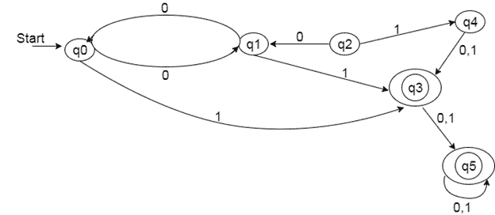
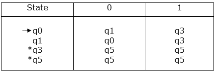
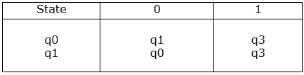
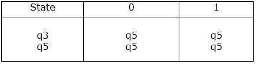
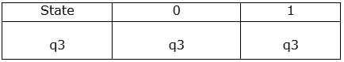
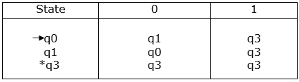
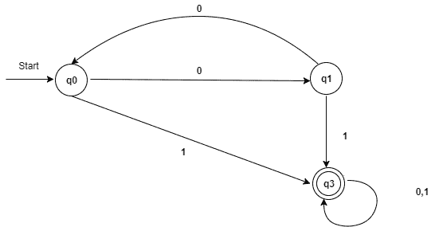

# DFA 的优化

> 原文：<https://www.javatpoint.com/optimization-of-dfa>

要优化 DFA，您必须遵循各种步骤。这些措施如下:

**步骤 1:** 通过 DFA 的任意一组转换，从初始状态中移除所有不可达的状态。

**步骤 2:** 绘制所有状态对的转换表。

**步骤 3:** 现在将转换表拆分为两个表 T1 和 T2。T1 包含所有最终状态，T2 包含非最终状态。

**第 4 步:**从 T1 中找出相似的行，这样:

```

δ (q, a) = p
δ (r, a) = p

```

也就是说，找到 a 和 b 值相同的两个状态，去掉其中一个。

**步骤 5:** 重复步骤 3，直到过渡表 T1 中没有类似的行可用。

**第 6 步:**同样对 T2 桌重复第 3 步和第 4 步。

**第 7 步:**现在合并简化的 T1 和 T2 表。组合转换表是最小化 DFA 的转换表。

### 例子



### 解决方案:

**步骤 1:** 在给定的 DFA 中，q2 和 q4 是不可到达的状态，因此将其移除。

**第二步:**画出其余状态的过渡表。



**第三步:**

现在将转换表的行分成两组，如下所示:

**1。**一组包含那些从非最终状态开始的行:



**2。**其他集合包含从最终状态开始的那些行。



**步骤 4:** 集合 1 没有相似的行，因此集合 1 将是相同的。

**步骤 5:** 在集合 2 中，行 1 和行 2 是相似的，因为 q3 和 q5 在 0 和 1 上转换到相同的状态。所以跳过 q5，然后在剩下的部分用 q3 代替 q5。



**第 6 步:**现在将第 1 组和第 2 组组合为:



现在是最小化 DFA 的过渡表。

最小化 DFA 的转换图；



**图:最小化 DFA**