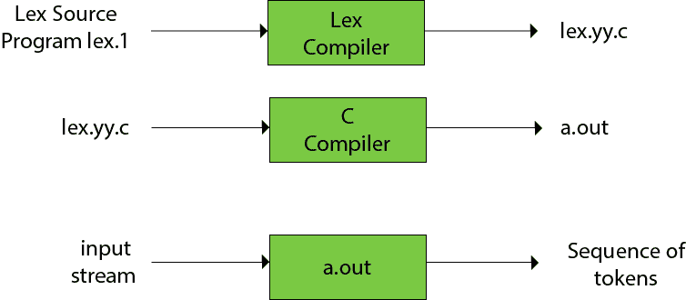

# 法律

> 原文：<https://www.javatpoint.com/lex>

*   Lex 是一个生成词法分析器的程序。它与 YACC 解析器生成器一起使用。
*   词法分析器是一个将输入流转换成一系列标记的程序。
*   它读取输入流，并通过在 C 程序中实现词法分析器产生源代码作为输出。

### 莱克斯的职能如下:

*   首先，词法分析器用 lex 语言创建了一个程序 lex.1。然后 Lex 编译器运行 lex.1 程序，产生一个 C 程序 lex.yy.c。
*   最后 C 编译器运行 lex.yy.c 程序，产生一个目标程序 a.out。
*   a.out 是词法分析器，它将输入流转换成一系列标记。



## Lex 文件格式

Lex 程序被%%分隔符分成三个部分。Lex 来源的形式如下:

```
{ definitions } 
%%
 { rules } 
%% 
{ user subroutines }

```

**定义**包括常量、变量和常规定义的声明。

**规则**定义表单 p1 {action1} p2 {action2}的语句....pn {action}。

其中 **pi** 描述正则表达式， **action1** 描述当模式 pi 匹配一个词位时词法分析器应该采取的动作。

**用户子程序**是动作所需的辅助程序。子程序可以用词法分析器加载，也可以单独编译。