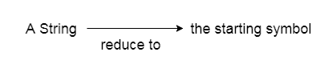
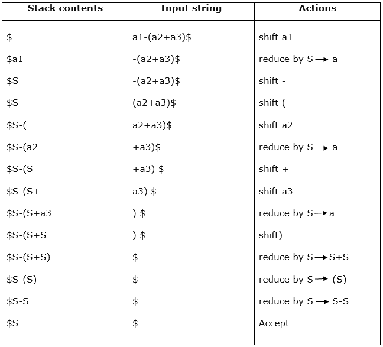

# 移位简化分析

> 原文：<https://www.javatpoint.com/shift-reduce-parsing>

*   Shift reduce 解析是将字符串简化为语法开始符号的过程。
*   Shift reduce 解析使用堆栈来保存语法，使用输入磁带来保存字符串。



*   Sift reduce 解析执行两个动作:shift 和 reduce。这就是为什么它被称为移位减少解析。
*   在移位操作中，输入字符串中的当前符号被推入堆栈。
*   每次缩小时，符号将由非端子代替。符号是产品的右侧，非终端是产品的左侧。

### 示例:

**语法:**

```

S → S+S  
S → S-S  
S → (S)
S → a

```

**输入字符串:**

```

a1-(a2+a3)

```

**解析表:**



shift reduce 解析有两个主要类别，如下所示:

1.  运算符优先解析
2.  LR 解析器