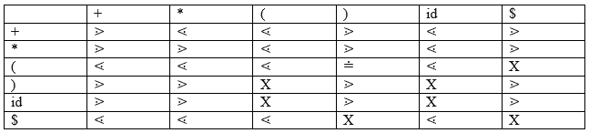
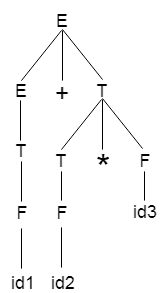
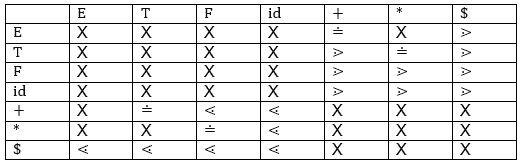
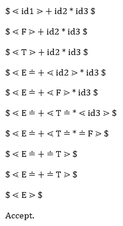

# 运算符优先解析

> 原文：<https://www.javatpoint.com/operator-precedence-parsing>

运算符优先语法是移位约简语法的一种。它适用于一个小类的运算符语法。

如果一个语法有两个性质，则称它为运算符优先语法:

*   任何产品的 R.H.S .都没有∑。
*   没有两个非端子相邻。

运算符优先级只能在语法的端点之间建立。它忽略了非终端。

## 有三种运算符优先关系:

a ⋗ b 意味着终端“a”的优先级高于终端“b”。

a ⋖ b 意味着终端“a”的优先级低于终端“b”。

a ≐ b 表示终端“a”和“b”具有相同的优先级。

### 优先表:



### 解析动作

*   在给定输入字符串的两端，添加$符号。
*   现在从左向右扫描输入字符串，直到遇到⋗。
*   在所有相等的优先级上向左扫描，直到遇到第一个最左边的⋖。
*   最左边的⋖和最右边的⋗之间的一切都是把柄。
*   $ on $表示解析成功。

### 例子

**语法:**

```

E → E+T/T
T → T*F/F
F → id

```

**给定字符串:**

```

w = id + id * id

```

让我们考虑如下解析树:



在上述树的基础上，我们可以设计如下的算子优先表:



现在让我们借助上面的优先表来处理这个字符串:

