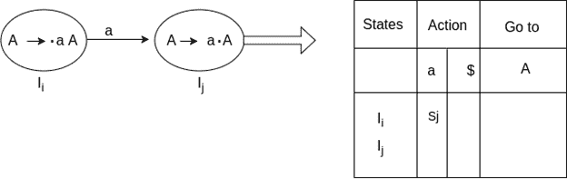
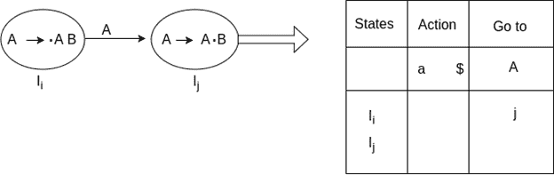
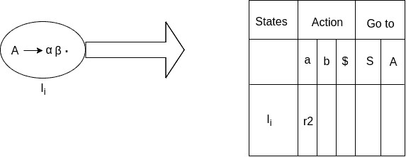
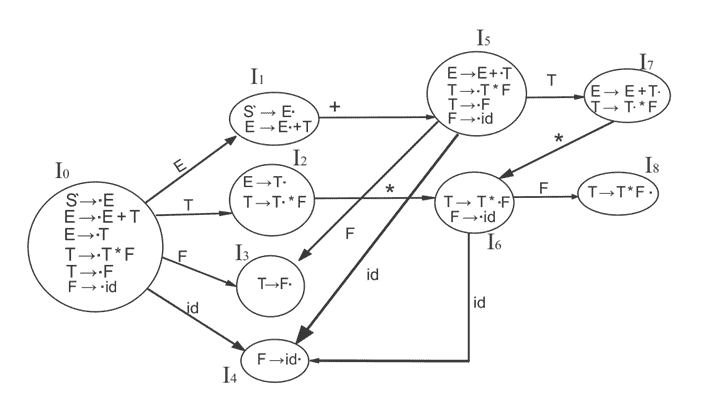
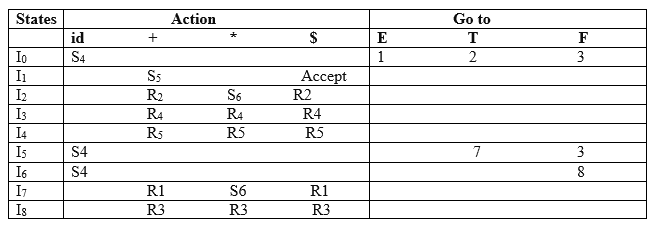

# 单反(1)解析

> 原文：<https://www.javatpoint.com/slr-1-parsing>

单反(1)指简单的单反解析。它与 LR(0)解析相同。唯一的区别在于解析表。为了构造单反(1)解析表，我们使用单反(0)项的规范集合。

在单反(1)解析中，我们只将缩小移动放在左手边的后面。

单反中涉及的各种步骤(1)解析:

*   对于给定的输入字符串，编写一个上下文无关的语法
*   检查语法的歧义
*   在给定的语法中添加扩充生成
*   创建 LR (0)项的规范集合
*   绘制数据流图
*   构建单反(1)解析表

## 单反(1)表结构

用于构建单反(1)表的步骤如下:

如果一个状态(I <sub>i</sub> )在一个终端上变成了另一个状态(I <sub>j</sub> ，那么它对应于动作部分的一个换档动作。



如果一个状态(I <sub>i</sub> )在一个变量上要进入另一个状态(I <sub>j</sub> )，那么它就对应着要进入“进入”部分。



如果一个状态(I <sub>i</sub> )包含像 A → ab 这样的最后一个没有转换到下一个状态的项目，那么生产被称为减少生产。对于 FOLLOW (A)中的所有端子 X，写下减少条目及其生产编号。

### 例子

```

S -> •Aa 
  A->αβ• 

```

```

            Follow(S) = {$}
            Follow (A) = {a}

```



### 单反(1)语法

s→e[t0e]→e+t | t
t→t * f | f
f→id

为 G 中的每一个产品添加“扩大生产”并在第一个位置插入“”符号

s `→
e→e+t
e→t
t→t * f
t→f
f→id

**I0 状态:**

将增量生产添加到 I0 状态并计算结束

**I0 =** 闭合(s `→E)

将状态中以 E 开头的所有制作添加到 I0，因为" "后面是非终结符。所以，I0 状态变成

**我 0 =**s `→
e→e+t
e→t

在修改后的 I0 状态下添加所有以 T 和 F 开头的制作，因为" "后面是非终结符。所以，I0 状态变成了。

**→
【e】→【e】→【t】
【e】→【t】
→【t】→【f】
→【f】
→【f】**

 ****I1=** 转到(I0，E) =闭包(S` → E，E→E+T)
T3】I2 =转到(I0，T) =闭包(E→T T，T →* F)
T6】I3 =转到(I0，F) =闭包(T→F)= T→F
**I4 =**转到(I0，id) =闭包

在 I5 状态下添加所有以 T 和 F 开头的作品，因为" "后面是非终结符。因此，I5 状态变为

**i5 =**e→e+
t→t * f
t→f
f→id

转到(I5，F) =闭包(T→F)=(与 I3 相同)
转到(I5，id) =闭包(F→id)=(与 I4 相同)

**I6=** 转到(I2，* =)闭包(T→T *·F)

在状态 I6 中添加所有以 F 开头的制作，因为" "后面是非终结符。所以，I6 状态变成

**i6 =**【t】→【t *【f】
f→id

转到(I6，id) =闭包(F→id)=(与 I4 相同)

**I7=** 转到(I5，T) =闭包(E→E+T)= E→E+T
T3】I8 =转到(I6，F) =闭包(T→T * F)= T→T * F

### 图纸 DFA:



### 单反(1)表



### 解释:

First(E)= First(E+T)∪First(T)
First(T * F)∪First(F)
First(F)= { id }
First(T)= { id }
First(E)= { id }
Follow(E)= First(+T)∩{ $} = {+，$ }
Follow(T)= First(* F)∪First(F)
= { *，+，$ }。

*   I1 包含驱动 S → E 并跟随(S) = {$}，因此动作{I1，$} =接受的最终项目
*   I2 包含驱动 E → T 并跟随(E) = {+，$}，因此动作{I2，+} = R2，动作{I2，$} = R2 的最后一项
*   I3 包含驱动 T → F 并跟随(T) = {+，*，$}，因此动作{I3，+} = R4，动作{I3，*} = R4，动作{I3，$} = R4
*   I4 包含驱动 F → id 并跟随(F) = {+，*，$}，所以动作{I4，+} = R5，动作{I4，*} = R5，动作{I4，$} = R5
*   I7 包含驱动 E → E + T 并跟随(E) = {+，$}，因此动作{I7，+} = R1，动作{I7，$} = R1
*   I8 包含驱动 T → T * F 的最终项目，并跟随(T) = {+，*，$}，因此动作{I8，+} = R3，动作{I8，*} = R3，动作{I8，$} = R3。**