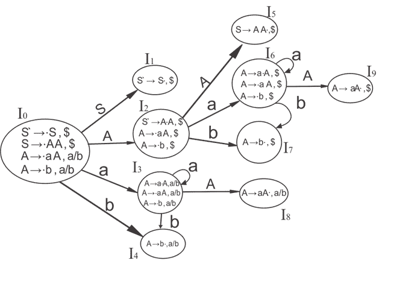
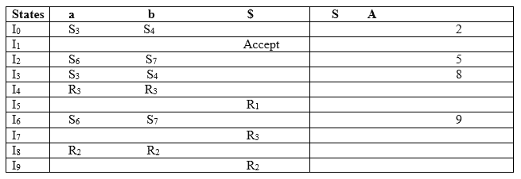

# CLR (1)解析

> 原文：<https://www.javatpoint.com/clr-1-parsing>

CLR 指的是规范前瞻。CLR 解析使用 LR (1)项的规范集合来构建 CLR (1)解析表。与 SLR (1)解析相比，CLR (1)解析表产生更多的状态。

在 CLR (1)中，我们只将 reduce 节点放在前瞻符号中。

CLR 中涉及的各种步骤(1)解析:

*   对于给定的输入字符串，编写一个上下文无关的语法
*   检查语法的歧义
*   在给定的语法中添加扩充生成
*   创建 LR (0)项的规范集合
*   绘制数据流图
*   构造一个 CLR (1)解析表

**LR (1)项**

LR (1)项是 LR (0)项和前瞻符号的集合。

**LR (1)项= LR (0)项+前瞻**

前瞻用于确定我们将最终项目放在哪里。

前瞻总是为参数生成添加$符号。

### 例子

**CLR ( 1)语法**

```

S → AA
A → aA
A → b

```

添加增强生产，在 G 中每个生产的第一个位置插入“”符号，并添加前瞻。

```

S` → •S, $
S  → •AA, $
A  → •aA, a/b 
A → •b, a/b

```

**I0 状态:**

将增量生产添加到 I0 状态并计算结束

**I0 =** 闭合(S `→S)

将所有以 S 开头的制作添加到 I0 状态，因为" "后面是非终结符。所以，I0 状态变成

**I0 =**S `→S，$
S→AA，$

在修改后的 I0 状态下添加所有以 A 开头的制作，因为" "后面是非终结符。所以，I0 状态变成了。

**I0 =**S `→S，$
S→AA，$
A→AA，a/b
A→b，A/b

**I1=** 转到(I0，S) =闭包(S `→S ,$)= S `→S ,$
T3】I2 =转到(I0，A) =闭包(S→A . A ,$)

添加 I2 状态下以 A 开头的所有制作，因为" "后面是非终结符。所以，I2 状态变成

**I2 =**S→A A，$
A→aA，$
A→b，$

**I3=** 转到(I0，a) =闭包(A→A A，a/b)

在 I3 状态下添加所有以 A 开头的作品，因为" "后面是非终结符。所以，I3 状态变成了

**I3 =**A→A A，a/b
A→aA，A/b
A→b，A/b

转到(I3，a) =闭包(A→A A，a/b) =(与 I3 相同)
转到(I3，b) =闭包(A → b，a/b) =(与 I4 相同)

**I4=** 转到(I0，b) =闭包(A → b，a/b) = A → b，A/b
T3】I5 =转到(I2，A) =闭包(S → AA，$) =S → AA，$
T6】I6 =转到(I2，a) =闭包(A→A A，$)

在状态 I6 中添加所有以 A 开头的制作，因为" "后面是非终结符。所以，I6 状态变成

**I6 =**A→A A，$
A→aA，$
A→b，$

转到(I6，a) =闭包(A→A A，$) =(与 I6 相同)
转到(I6，b) =闭包(A → b，$) =(与 I7 相同)

**I7=** 转到(I2，b) =闭包(A→b ,$)= A→b ,$
T3】I8 =转到(I3，A) =闭包(A → aA，a/b) = A → aA，A/b
T6】I9 =转到(I6，A) =闭包(A→aA ,$)= A→aA ,$

### 图纸 DFA:



## CLR (1)解析表:



产品编号如下:

```

     S  →  AA      ... (1)                                
       A  → aA       ....(2)   
       A  →  b     ... (3)

```

移位节点在 CLR (1)解析表中的位置与 SLR (1)解析表相同。只有减少节点的位置不同。

I4 包含驱动的最终项目(A → b，a/b)，因此操作{I4，a} = R3，操作{I4，b} = R3。
I5 包含驱动的最终项目(S→AA ,$)，所以动作{I5，$} = R1。
I7 包含驱动的最终项目(A → b，$)，所以动作{I7，$} = R3。
I8 包含驱动的最终项目(A→aA ,/ A ),因此动作{I8，a} = R2，动作{I8，b} = R2。
I9 包含驱动的最终项目(A→aA ,$)，所以动作{I9，$} = R2。