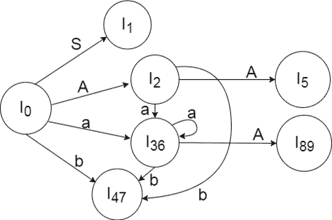
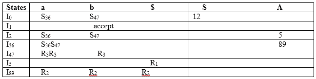

# LALR (1)解析:

> 原文：<https://www.javatpoint.com/lalr-1-parsing>

LALR 指的是前瞻 LR。为了构造 LALR (1)解析表，我们使用 LR (1)项的规范集合。

In the LALR (1) parsing, the LR (1) items which have same productions but different look ahead are combined to form a single set of items

LALR (1)解析与 CLR (1)解析相同，只是解析表不同。

### 例子

**LALR ( 1 ) Grammar**

```

S → AA
A  → aA
A → b

```

添加扩大生产，在 G 中的每个生产的第一个位置插入“‘符号，并添加前瞻。

```

S` → •S, $
S  → •AA, $
A  → •aA, a/b 
A  → •b, a/b

```

**I0 状态:**

将增量生产添加到 I0 状态并计算成本

**I0 =** 闭合(S `→S)

将所有以 S 开头的产品添加到 I0 状态，因为“”后面是非终端。所以，I0 状态变成

**I0 =**S `→S，$
S→AA，$

在修改后的 I0 状态下添加所有以 A 开头的作品，因为“”后面是非终结符。所以，I0 状态变成了。

**I0 =**S `→S，$
S→AA，$
A→AA，a/b
A→b，A/b

**I1=** 转到(I0，S) =闭包(S `→S ,$)= S `→S ,$
T3】I2 =转到(I0，A) =闭包(S→A . A ,$)

在 I2 状态下添加所有以 A 开头的产品，因为“”后面是非终端。所以，I2 状态变成

**I2 =**S→A A，$
A→aA，$
A→b，$

**I3=** 转到(I0，a) =闭包(A→A A，a/b)

在 I3 状态下添加所有以 A 开头的作品，因为“”后面是非终端。所以，I3 状态变成了

**I3 =**A→A A，a/b
A→aA，A/b
A→b，A/b

转到(I3，a) =闭包(A→A A，a/b) =(与 I3 相同)
转到(I3，b) =闭包(A → b，a/b) =(与 I4 相同)

**I4=** 转到(I0，b) =闭包(A → b，a/b) = A → b，A/b
T3】I5 =转到(I2，A) =闭包(S → AA，$) =S → AA，$
T6】I6 =转到(I2，a) =闭包(A→A A，$)

在状态 I6 中添加所有以 A 开头的作品，因为“”后面是非终结符。所以，I6 状态变成

**I6 =**A→A A，$
A→aA，$
A→b，$

转到(I6，a) =闭包(A→A A，$) =(与 I6 相同)
转到(I6，b) =闭包(A → b，$) =(与 I7 相同)

**I7=** 转到(I2，b) =闭包(A → b，$) = A → b，$
T3】I8 =转到(I3，A) =闭包(A → aA，a/b) = A → aA，A/b
T6】I9 =转到(I6，A) =闭包(A → aA，$) A → aA，$

如果我们分析，那么 I3 和 I6 的 LR (0)项是相同的，但它们的区别仅在于它们的前瞻。

**I3 =**{ A→A A，A/b
A→aA，A/b
A→b，a/b

**I6 =**{ A→A A，$
A→aA，$
A→b，$

很明显，I3 和 I6 在 LR (0)项上是相同的，但在前瞻方面有所不同，所以我们可以将它们组合起来，称为 I36。

**I36 =**{ A→A A、A/b/$
A→aA、A/b/$
A→b、a/b/$

I4 和 I7 是相同的，但它们的区别仅在于它们的前瞻，因此我们可以将它们组合起来，称为 I47。

**I47 =** {A → b，a/b/$}

I8 和 I9 是相同的，但它们的区别仅在于它们的前瞻性，因此我们可以将它们组合起来，称为 I89。

**I89 =** {A → aA，a/b/$}

### 图纸 DFA:



## LALR (1)解析表:

