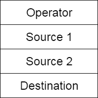

# 四倍

> 原文：<https://www.javatpoint.com/quadruples>

四元组有四个字段来实现三个地址码。四元组字段分别包含运算符的名称、第一个源操作数、第二个源操作数和结果。



**图:四倍场**

### 例子

```

a := -b * c + d

```

三地址编码如下:

```
			t1 := -b
			t2 := c + d
            t3 := t1 * t2
			a := t3

```

这些语句用四倍表示如下:

|  | 操作员 | 来源 1 | 来源 2 | 目的地 |
| (0) | uminus | b | - | t <sub>1</sub> |
| (1) | + | c | d | t <sub>2</sub> |
| (2) | * | t <sub>1</sub> | t <sub>2</sub> | t <sub>3</sub> |
| (3) | := | t <sub>3</sub> | - | a |