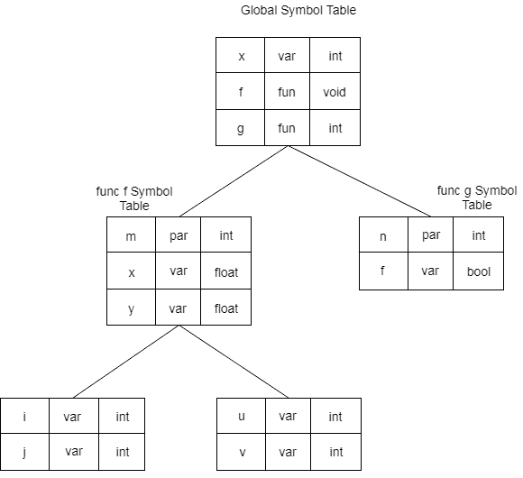

# 表示范围信息

> 原文：<https://www.javatpoint.com/representing-scope-information>

在源程序中，每个名字都有一个有效区域，称为名字的范围。

块结构语言中的规则如下:

1.  如果一个名字在块 B 中声明，那么它将只在块 B 中有效
2.  如果 B1 区块嵌套在 B2 内，那么对 B2 区块有效的名称对 B1 也有效，除非名称的标识符在 B1 中重新声明。

*   这些范围规则需要比名称和属性之间的关联列表更复杂的符号表组织。
*   表被组织成堆栈，每个表都包含名称及其相关属性的列表。
*   每当输入一个新的数据块，就有一个新的表输入到堆栈中。新表保存声明为此块本地的名称。
*   编译声明时，会在表中搜索一个名称。
*   如果在表中找不到该名称，则插入新名称。
*   当名称的引用被翻译后，从堆栈上的每个表开始搜索每个表。

## 例如:

```

int x;
void f(int m) {
     float x, y;
{
            int i, j;
            int u, v;
}
}
int g (int n)
{
      bool t;
}

```



**图:**符合静态范围信息规则的符号表组织