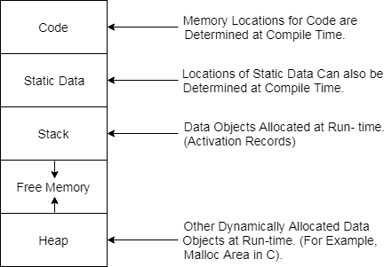

# 存储结构

> 原文：<https://www.javatpoint.com/storage-organization>

*   当目标程序执行时，它在自己的逻辑地址空间中运行，每个程序的值都有一个位置。
*   逻辑地址空间在编译器、操作系统和目标机器之间共享，用于管理和组织。操作系统用于将逻辑地址映射到物理地址，物理地址通常分布在整个内存中。

## 运行时内存的细分:

*   运行时存储分为块，其中一个字节用于显示可寻址内存的最小单位。利用机器字可以形成的四个字节。对象以连续字节存储，并给出第一个字节地址。
*   运行时存储可以细分为保存正在执行的程序的不同组件:

1.  生成的可执行代码
2.  静态数据对象
3.  动态数据对象堆
4.  自动数据对象-堆栈