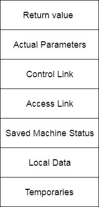

# 现役记录

> 原文：<https://www.javatpoint.com/activation-record>

*   控制堆栈是一个运行时堆栈，用于跟踪实时过程激活，即用于找出尚未完成执行的过程。
*   当它被调用(激活开始)时，过程名将被推入堆栈，当它返回(激活结束)时，它将弹出。
*   激活记录用于管理单次执行过程所需的信息。
*   当调用过程时，激活记录被推入堆栈，当控件返回调用方函数时，激活记录被弹出。

下图显示了激活记录的内容:

**返回值:**被调用过程用来给调用过程返回值。

**实际参数:**由调用过程使用，为被调用过程提供参数。

**控制链接:**指向主叫方的激活记录。

**访问链接:**用于引用其他激活记录中保存的非本地数据。

**保存的机器状态:**保存程序调用前机器的状态信息。

**本地数据:**它保存程序执行本地的数据。

**临时变量:**它存储表达式求值时产生的值。