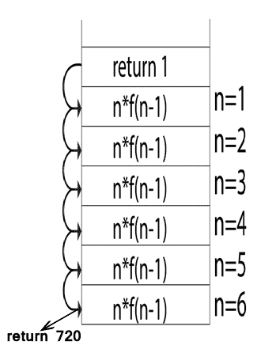

# 存储分配

> 原文：<https://www.javatpoint.com/storage-allocation>

分配内存的不同方法有:

1.  静态存储器分配
2.  堆栈存储分配
3.  堆存储分配

## 静态存储器分配

*   在静态分配中，名称绑定到存储位置。
*   如果内存是在编译时创建的，那么内存将在静态区域创建，并且只创建一次。
*   静态分配支持动态数据结构，这意味着只在编译时创建内存，并在程序完成后释放内存。
*   静态存储分配的缺点是数据对象的大小和位置应该在编译时知道。
*   另一个缺点是递归过程的限制。

## 堆栈存储分配

*   在静态存储分配中，存储被组织为堆栈。
*   激活记录在激活开始时被推入堆栈，并在激活结束时弹出。
*   激活记录包含局部变量，因此它们被绑定到每个激活记录中的新存储。激活结束时，本地变量的值将被删除。
*   它基于后进先出法工作，这种分配支持递归过程。

## 堆存储分配

*   堆分配是最灵活的分配方案。
*   根据用户的要求，内存的分配和解除分配可以在任何时间和任何地点进行。
*   堆分配用于动态地为变量分配内存，当变量不再使用时，再收回内存。
*   堆存储分配支持递归过程。

### 示例:

```

fact (int n)
{
   if (n<=1)
       return 1;
   else 
       return (n * fact(n-1));
}
fact (6)

```

动态分配如下:

