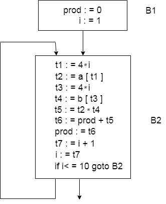

# 流向图

> 原文：<https://www.javatpoint.com/flow-graph>

流程图是有向图。它包含该组基本块的控制信息流。

控制流图用于描述程序控制是如何在块之间被解析的。这在循环优化中很有用。

矢量点积的流程图如下所示:

*   块 B1 是初始节点。B2 街区紧跟着 B1，所以从 B2 到 B1 有一个优势。
*   从 B1 的最后一个语句跳转的目标是 B2 的第一个语句，所以从 B1 到 B2 是有优势的。
*   B2 是 B1 的继承者，B1 是 B2 的前身。