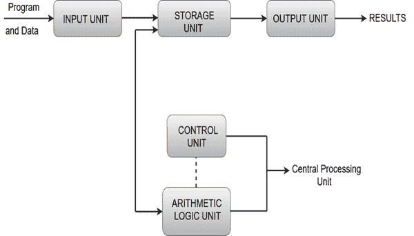

# 数字系统的功能单元

> 原文：<https://www.javatpoint.com/functional-units-of-digital-system>

*   计算机组织描述了数字系统中各个单元的功能和设计。
*   通用计算机系统是数字系统最著名的例子。其他例子包括电话交换交换机、数字电压表、数字计数器、电子计算器和数字显示器。
*   计算机体系结构处理指令集和实现指令的硬件单元的规范。
*   计算机硬件包括电子电路、显示器、磁和光存储介质以及通信设施。
*   功能单元是中央处理器的一部分，执行计算机程序要求的操作和计算。
*   计算机系统的功能单元是执行计算机程序要求的操作和计算的中央处理器的一部分。计算机由五个主要部分组成，即输入单元、中央处理单元、存储单元、算术逻辑单元、控制单元和输出单元。

## 输入装置

*   计算机使用输入单元来读取数据。最常用的输入设备是键盘、鼠标、操纵杆、轨迹球、麦克风等。
*   然而，最著名的输入设备是键盘。只要按下一个键，相应的字母或数字就会自动转换成相应的二进制代码，并通过电缆传输到存储器或处理器。

## 中央处理机

*   通常被称为中央处理器的中央处理单元可以被称为计算机内的电子电路，其通过执行由指令指定的基本算术、逻辑、控制和输入/输出(I/O)操作来执行由计算机程序给出的指令。

## 存储单元

*   存储单元可以被称为存储区域，在其中保存正在运行的程序，并且包含正在运行的程序所需的数据。
*   内存单元可以分为两类，即主内存和辅助内存。
*   它使处理器能够访问临时存储在特定内存位置的运行中的执行应用程序和服务。
*   主存储器是以电子速度运行的最快的存储器。主存储器包含大量半导体存储单元，能够存储一位信息。计算机的字长在 16-64 位之间。
*   它也被称为易失性内存，意味着当计算机关闭时，内存中包含的任何东西都会丢失。
*   高速缓冲存储器也是一种用于快速获取数据的存储器。它们与处理器高度耦合。
*   主存储器最常见的例子是随机存取存储器和只读存储器。
*   当需要长期存储大量数据和程序时，使用辅助存储器。
*   它也被称为非易失性存储器形式的存储器，意味着数据被永久存储而不考虑关闭。
*   辅助存储器最常见的例子是磁盘、磁带和光盘。

## 算术和逻辑单元

*   计算机的大多数算术和逻辑运算都是在处理器的算术逻辑单元中执行的。它执行算术运算，如加法、减法、乘法、除法，以及逻辑运算，如与、或、非运算。

## 控制部件

*   控制单元是计算机中央处理单元的一个组件，它协调处理器的操作。它告诉计算机的内存、算术/逻辑单元和输入输出设备如何响应程序指令。
*   控制单元也被称为计算机系统的神经中枢。
*   让我们考虑一个例子，两个操作数相加的指令为添加 LOCA，RO。该指令将内存位置 LOCA 添加到寄存器 RO 中的操作数，并将总和放入寄存器 RO 中。该指令在内部执行几个步骤。

## 输出装置

*   输出单元的主要功能是将处理后的结果发送给用户。输出设备以用户能够理解的方式显示信息。
*   输出设备是用于产生信息或由计算机处理的任何其他响应的设备。这些设备显示计算机中保存或生成的信息。
*   输出设备最常见的例子是监视器。