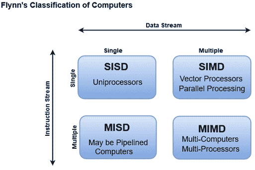

# 弗林的计算机分类

> 原文：<https://www.javatpoint.com/flynns-classification-of-computers>

M.J .弗林提出了一种根据同时操作的指令和数据项的数量对计算机系统的组织进行分类的方法。

从存储器中读取的指令序列构成了**指令流**。

在处理器中对数据执行的操作构成了**数据流**。

#### 注:术语“流”是指指令或数据的流动。

并行处理可以发生在指令流、数据流或两者中。

### 弗林的分类将计算机分为四大类:

1.  [单指令流，单数据流(SISD)](sisd)
2.  [单指令流，多数据流(SIMD)](simd)
3.  [多指令流，单数据流(MISD)](misd)
4.  [多指令流、多数据流(MIMD)](mimd)

