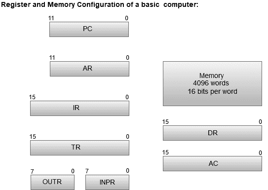

# 计算机寄存器

> 原文：<https://www.javatpoint.com/computer-registers>

寄存器是一种计算机内存，用于快速接受、存储和传输中央处理器正在立即使用的数据和指令。中央处理器使用的寄存器通常称为处理器寄存器。

处理器寄存器可以保存指令、存储地址或任何数据(如位序列或单个字符)。

计算机需要处理器寄存器来处理数据，还需要一个寄存器来保存内存地址。保存存储单元的寄存器用于在当前指令执行完成后计算下一条指令的地址。

#### 下面列出了一些在基本计算机中最常用的寄存器:

| 注册 | 标志 | 位数 | 功能 |
| 数据寄存器 | 速度三角形定位法(dead reckoning) | Sixteen | 保存内存操作数 |
| 地址寄存器 | 阿肯色州 | Twelve | 保存内存的地址 |
| 蓄电池 | 英亩 | Sixteen | 处理器寄存器 |
| 指令寄存器 | 红外的 | Sixteen | 保存指令代码 |
| 程序计数器 | 个人电脑 | Twelve | 保存指令的地址 |
| 暂存寄存器 | 土耳其 | Sixteen | 保存临时数据 |
| 输入寄存器 | INPR | eight | 携带输入字符 |
| 输出寄存器 | OUTR | eight | 携带输出字符 |

下图显示了基本计算机的寄存器和内存配置。

*   存储单元的容量为 4096 个字，每个字包含 16 位。
*   数据寄存器包含 16 位，用于保存从存储单元读取的操作数。
*   内存地址寄存器(MAR)包含 12 位，保存内存位置的地址。
*   程序计数器(PC)也包含 12 位，保存当前指令执行后要从内存中读取的下一条指令的地址。
*   累加器寄存器是一个通用处理寄存器。
*   从存储器中读取的指令放在指令寄存器中。
*   临时寄存器用于在处理过程中保存临时数据。
*   输入寄存器保存用户给出的输入字符。
*   输出寄存器(或)保存处理输入数据后的输出。