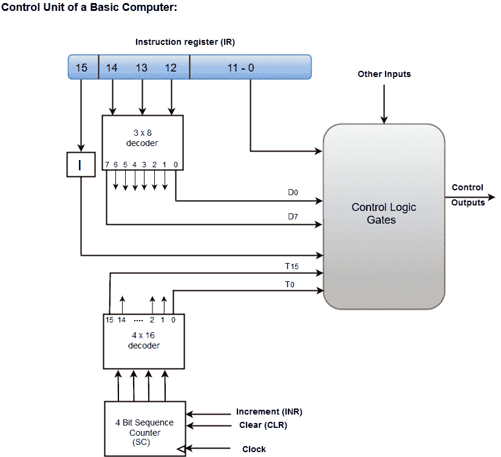
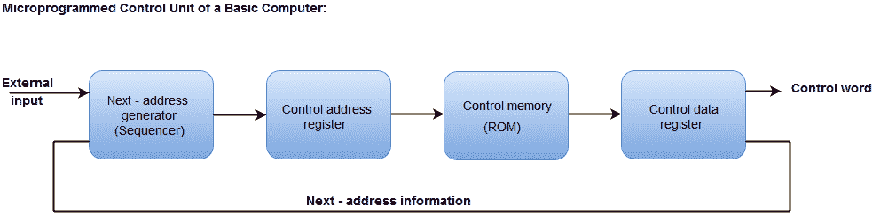

# 控制单元的设计

> 原文：<https://www.javatpoint.com/design-of-control-unit>

控制单元分为两大类:

1.  硬连线控制
2.  微程序控制

## 硬连线控制

硬连线控制组织包括用门、触发器、解码器和其他数字电路实现的控制逻辑。

下图显示了硬连线控制组织的框图。

*   硬连线控制由两个解码器、一个序列计数器和多个逻辑门组成。
*   从存储单元取出的指令被放置在指令寄存器中。
*   指令寄存器的组件包括:操作码 I 位和 0 到 11 位。
*   12 至 14 位的操作码用 3×8 解码器编码。
*   解码器的输出由符号 D0 至 D7 表示。
*   第 15 位的操作码被传送到由符号 I 指定的触发器
*   从位 0 到 11 的操作码被施加到控制逻辑门。
*   序列计数器可以从 0 到 15 进行二进制计数。

## 微程序控制

微程序控制组织是通过使用编程方法实现的。

在微程序控制中，微操作是通过执行由微指令组成的程序来完成的。

下图显示了微程序控制组织的框图。

*   控制存储器地址寄存器指定微指令的地址。
*   控制存储器假定为只读存储器，所有控制信息永久存储在其中。
*   控制寄存器保存从存储器中取出的微指令。
*   微指令包含一个控制字，用于指定数据处理器的一个或多个微操作。
*   当微操作正在执行时，在下一个地址发生器电路中计算下一个地址，然后传送到控制地址寄存器以读取下一个微指令。
*   下一个地址发生器通常被称为微程序定序器，因为它决定从控制存储器中读取的地址序列。