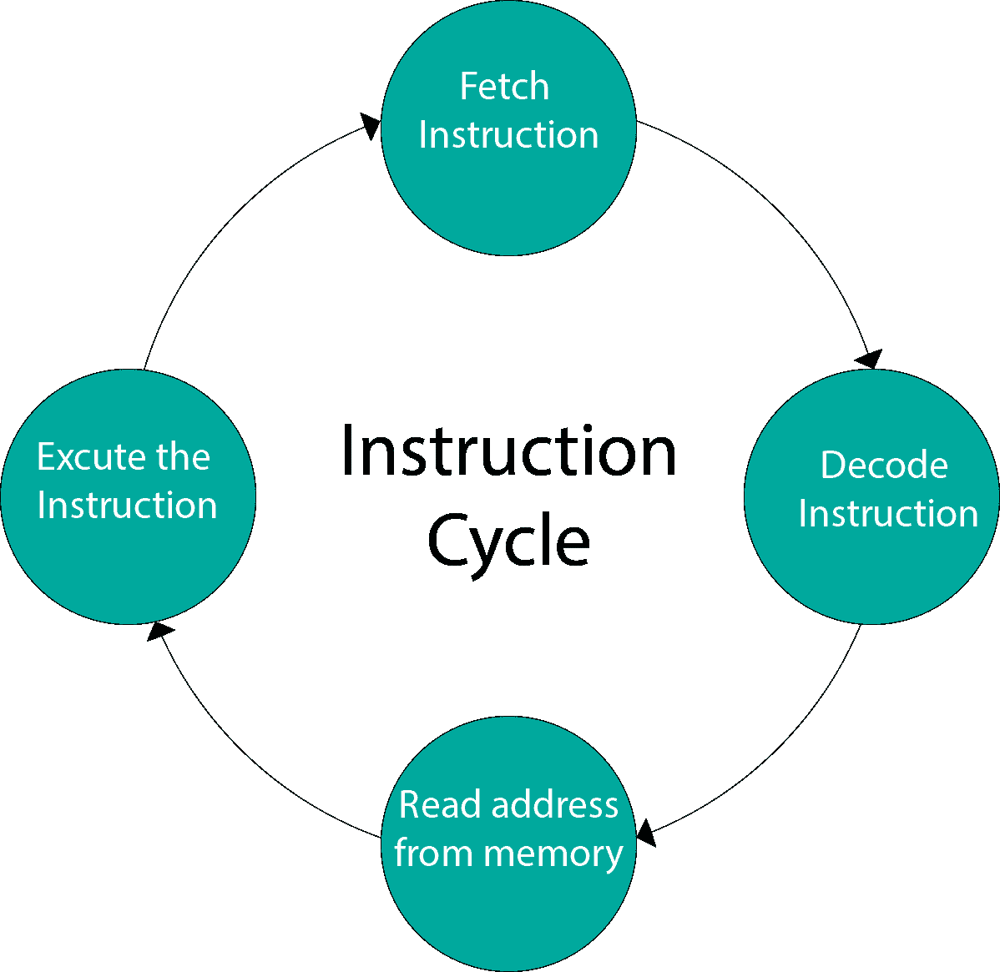
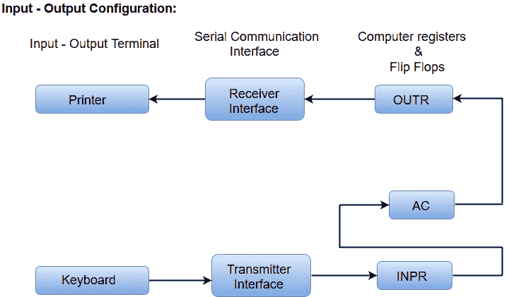

# 指令周期

> 原文：<https://www.javatpoint.com/instruction-cycle>

驻留在计算机存储单元中的程序由一系列指令组成。这些指令由处理器通过对每个指令执行一个周期来执行。

在基本计算机中，每个指令周期由以下阶段组成:

1.  从内存中获取指令。
2.  解码指令。
3.  从内存中读取有效地址。
4.  执行指令。

## 输入输出配置

在计算机体系结构中，输入输出设备充当机器和用户之间的接口。

存储在存储器中的指令和数据必须来自某个输入设备。结果通过一些输出设备显示给用户。

下面的框图显示了基本计算机的输入输出配置。

*   输入输出终端发送和接收信息。
*   传输的信息量总是有 8 位字母数字代码。
*   通过键盘产生的信息被转移到输入寄存器“INPR”中。
*   打印机的信息存储在输出寄存器“OUTR”中。
*   INPR 寄存器和外接寄存器通过通信接口串行通信，并与交流接口并行通信。
*   发射器接口从键盘接收信息，并将其传输到 INPR。
*   接收器接口从 OUTR 接收信息，并将其串行发送到打印机。

## 一台基础计算机的设计

基本计算机由以下硬件组件组成。

1.  一种存储单元，有 4096 个字，每个字 16 位
2.  寄存器:交流(累加器)、数据寄存器、地址寄存器、指令寄存器、程序计数器、临时寄存器、序列计数器、INPR(输入寄存器)和输出寄存器。
3.  人字拖:I，S，E，R，IEN，FGI 和 FGO

#### 注:FGI 和 FGO 是相应的输入和输出标志，被视为控制触发器。

1.  两个解码器:一个 3×8 操作解码器和 4×16 定时解码器
2.  16 位公共总线
3.  控制逻辑门
4.  连接到交流输入端的逻辑和加法器电路。