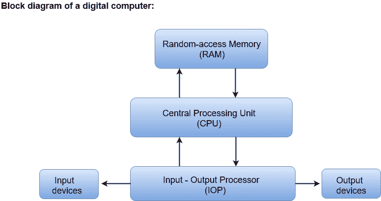

# 数字计算机

> 原文：<https://www.javatpoint.com/digital-computers>

数字计算机可以被认为是执行各种计算任务的数字系统。

第一台电子数字计算机开发于 20 世纪 40 年代末，主要用于数值计算。

按照惯例，数字计算机使用二进制数字系统，它有两个数字:0 和 1。二进制数字称为位。

计算机系统被细分为两个功能实体:硬件和软件。

硬件由构成设备物理实体的所有电子组件和机电设备组成。

计算机软件由指令和数据组成，计算机操纵这些指令和数据来执行各种数据处理任务。

*   中央处理单元包含用于处理数据的算术和逻辑单元、用于存储数据的多个寄存器以及用于获取和执行指令的控制电路。
*   数字计算机的存储单元包含指令和数据的存储器。
*   用于实时处理数据的随机存取存储器。
*   输入输出设备，用于从用户生成输入，并向用户显示最终结果。
*   连接到计算机的输入输出设备包括键盘、鼠标、终端、磁盘驱动器和其他通信设备。