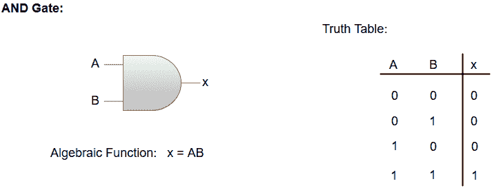
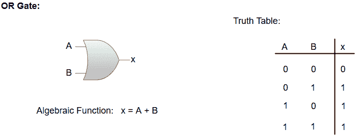
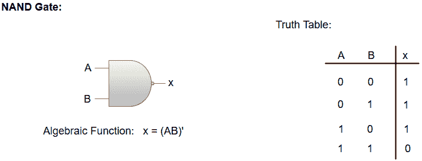
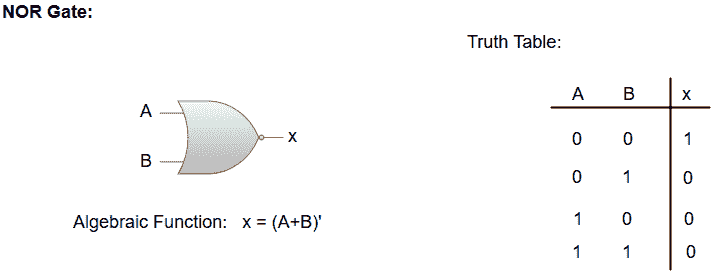
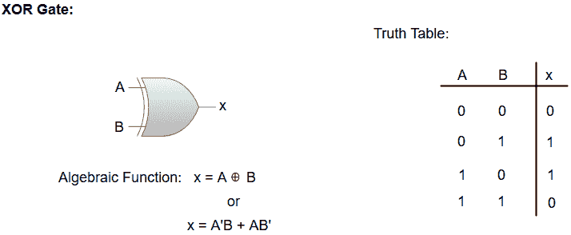
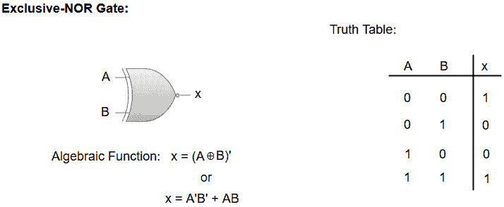

# 逻辑门

> 原文：<https://www.javatpoint.com/logic-gates>

*   逻辑门是数字系统的主要结构部分。
*   逻辑门是一个硬件模块，当满足输入逻辑要求时，它产生二进制 1 或 0 的信号。
*   每个门都有一个独特的图形符号，它的操作可以用代数表达式来描述。
*   七个基本逻辑门包括:与、或、异或、非、与非、或非和 XNOR。
*   每个门的输入输出二进制变量之间的关系可以用真值表以表格形式表示。
*   每个门有一个或两个由 A 和 B 指定的二进制输入变量和一个由 x 指定的二进制输出变量。

## 与门:

与门是一种电子电路，只有当它的所有输入都是高电平时，它才会给出高电平输出。“与”运算用点(^)表示。)签名。

## 或门:

“或”门是一种电子电路，如果它的一个或多个输入为高电平，则输出为高电平。“或”门执行的操作用加号(+)表示。

## 非门:

“非”门是一种在输出端产生反相输入的电子电路。它也被称为**逆变器**。

## 与非门:

“与非”门，相当于“与”门后跟“非”门。如果任一输入为低，与非门给出高输出。与非门由与门表示，输出端有一个小圆圈。小圆圈代表倒置。

## 或非门:

“非或”门，等于“或”门后跟“非”门。如果任一输入为高电平，或非门输出为低电平。或非门由输出端有一个小圆圈的或门表示。小圆圈代表倒置。

## 异或门:

“异或”门是一种电路，如果它的一个输入为高电平，但不是两个都为高电平，它将给出高电平输出。异或运算由一个带圆圈的加号表示。

## 异或门/等效门:

“异或门”是一个对异或门进行反操作的电路。如果它的一个输入为高电平，但不是两个都为高电平，它将给出低电平输出。小圆圈代表倒置。

