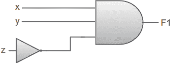
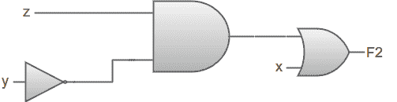
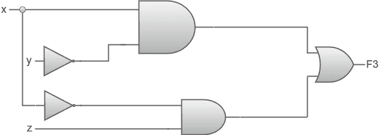
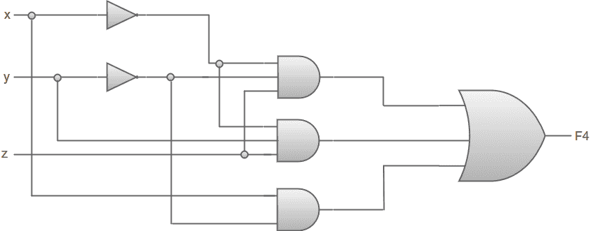

# 使用逻辑门简化布尔代数的例子

> 原文：<https://www.javatpoint.com/examples-of-boolean-algebra-simplification-using-logic-gates>

在本节中，我们将看一些使用逻辑门简化布尔代数的例子。

1.F1 = xyz '

2.F2 = x + y'z

3.F3 = xy' + x'z

4.F4 = x'y'z + x'yz + xy '

F1= xyz '，F2= x+y'z，F3= xy'+x'z 和 F4= x'y'z+x'yz+xy '的真值表

| x | y | z | 子一代 | 第二子代 | 第三子代 | 法乐四联症 |
| Zero | Zero | Zero | Zero | Zero | Zero | Zero |
| Zero | Zero | one | Zero | one | one | one |
| Zero | one | Zero | Zero | Zero | Zero | Zero |
| Zero | one | one | Zero | Zero | one | one |
| one | Zero | Zero | Zero | one | one | one |
| one | Zero | one | Zero | one | one | one |
| one | one | Zero | one | one | Zero | Zero |
| one | one | one | Zero | one | Zero | Zero |