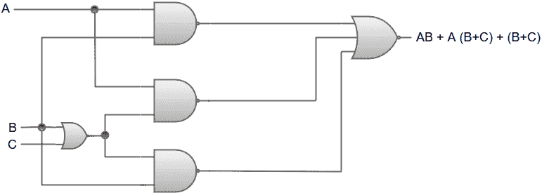
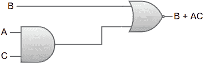

# 用布尔代数简化

> 原文：<https://www.javatpoint.com/simplification-using-boolean-algebra>

让我们考虑一个布尔函数的例子: **AB+A (B+C) + B (B+C)**

布尔函数 AB+A (B+C) + B (B+C)的逻辑图可以表示为:

我们将根据布尔代数给出的规则简化这个布尔函数。

AB + A (B+C) + B (B+C)

AB+AB+AC+BB+BC {分配律；A (B+C) = AB+AC，B (B+C) = BB+BC}

AB+AB+AC+b+ BC {幂等律；BB = B}

ab+AC+b+BC {幂律；AB+AB = AB}

AB+AC+B {吸收定律；B+BC = B}

b+ AC {吸收定律；AB+B = B}

因此，简化的布尔函数将是 B + AC。

布尔函数 B + AC 的逻辑图可以表示为:

