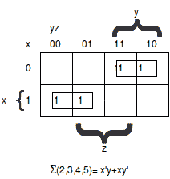
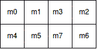
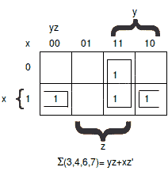

# 用映射方法简化布尔代数的例子

> 原文：<https://www.javatpoint.com/examples-of-boolean-algebra-simplifications-using-the-map-method>

1\. F（x，y，z） = S （2，3，4，5）

首先，在代表函数的每个最小项中标记 1。因此，010、011、100、101 标有 1。

随后，我们必须找到可能的相邻方块。这些在地图中由两个矩形表示，每个矩形包含两个 1。

右上角的矩形表示 x'y 包围的区域。

左下角的矩形代表产品术语“xy”。

这两项之和给出了简化表达式:

F= x'y+ xy '

#### 注意:在某些情况下，地图中的两个正方形被认为是相邻的，即使它们彼此不接触。在下图中，m0 与 m2 相邻，m4 与 m6 相邻，因为最小项相差一个变量。

代数验证:

m0+m2 = x ' y ' z '+x ' yz ' = x ' z '(y '+y)= x ' z '

m4+m6 = xy'z' + xyz'= xz' + (y'+y) = xz '

2\. F（x，y，z） = S（3，4，6，7）

如你所见，有四个标有 1 的方块，每个方块代表一个函数的最小项。

另外两个相邻的方块在第三列组合在一起，形成一个双文字项 yz。

上图中显示了剩余的两个 1 的正方形，它们的值被包围在半个矩形中。当这两个半矩形组合在一起时，会产生两个文字项 xz’。

简化后的函数变成 F = yz+xz’。