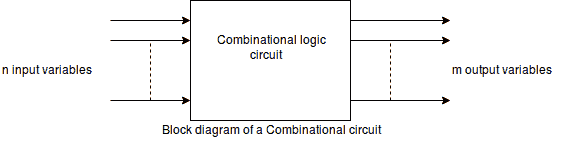

# 组合电路

> 原文：<https://www.javatpoint.com/combinational-circuits>

组合电路由逻辑门组成，其输出在任何时候都直接由输入的当前组合来确定，而不考虑先前的输入。

组合电路执行由一组布尔函数在逻辑上完全指定的特定信息处理操作。

组合电路的基本组成部分是:输入变量、逻辑门和输出变量。

“n”个输入变量来自外部源，而“m”个输出变量去往外部目的地。在许多应用中，源或目标是存储寄存器。

## 组合电路的设计过程

组合电路的设计过程包括以下步骤:

1.  问题陈述完毕。
2.  确定可用输入变量和所需输出变量的总数。
3.  输入和输出变量用字母符号分配。
4.  导出了定义输入和输出之间所需关系的精确真值表。
5.  从每个输出中获得简化的布尔函数。
6.  绘制了逻辑图。

执行两位相加的组合电路称为半加法器，执行三位相加(两个有效位和一个前进位)的组合电路称为全加器。