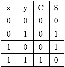
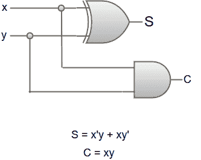

# 半加法器

> 原文：<https://www.javatpoint.com/half-adder>

半加法器电路需要两个二进制输入和两个二进制输出。输入变量显示被加数和加数位，而输出变量产生和与进位。我们可以通过建立真值表来理解半加法器的功能。半加法器的真值表是:

*   ‘x’和‘y’是两个输入，S (Sum)和 C (Carry)是两个输出。
*   进位输出为“0”，除非两个输入都为 1。
*   “s”代表总和的最低有效位。

乘积和(SOP)表达式的简化形式为:

S = x'y+xy '，C = xy

半加法器电路的逻辑图可以表示为:

