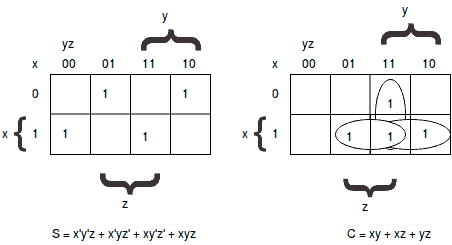
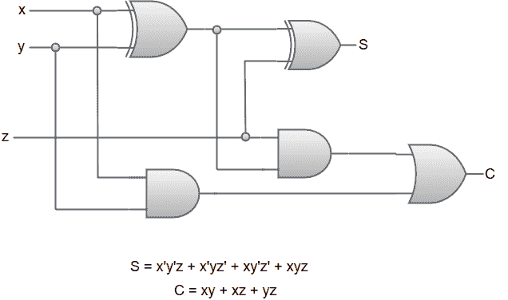

# 全加器

> 原文：<https://www.javatpoint.com/full-adder>

该电路需要三个二进制输入和两个二进制输出。全加器的真值表是:

*   输入变量“x”和“y”中的两个代表要添加的两个有效位。
*   第三个输入变量“z”代表前一个低位有效位置的进位。
*   输出用符号“S”表示和，“C”表示进位。
*   输入变量下的八行指定这些变量可能具有的 0 和 1 的所有可能组合。
*   全加器电路的输入-输出逻辑关系可以用两个布尔函数来表示，每个布尔函数对应一个输出变量。
*   通过使用唯一的映射方法，可以简化每个输出布尔函数。

**全加器的映射:**

全加器电路的逻辑图可以表示为:

