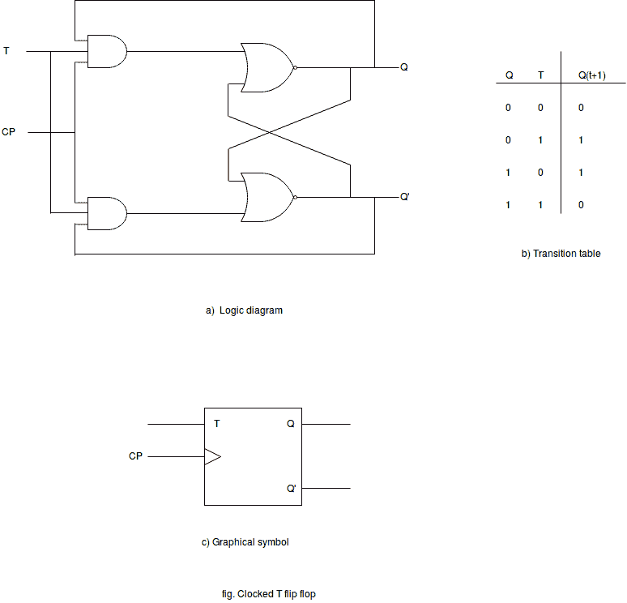

# 触发器

> 原文：<https://www.javatpoint.com/t-flip-flop>

t 触发器是 J-K 触发器的简单得多的版本。

J 和 K 输入都是连接的，也称为单输入 J-K 触发器。

## 触发器的触发

输入信号的瞬间变化会改变触发器的状态。这种瞬时变化被称为触发，它引起的转变被称为触发触发器。

脉冲触发时钟触发器。

脉冲从初始值“0”开始，瞬间变为“1”，过了一会儿，又回到其初始值“0”。

时钟脉冲可以是正的，也可以是负的。

正时钟源在脉冲间隔期间保持为“0”，在脉冲出现期间变为 1。

该脉冲经历两个信号转换:从“0”到“1”以及从“1”到“0”的返回。

## 时钟脉冲转换的定义:

正转变被定义为正边缘，负转变被定义为负边缘。