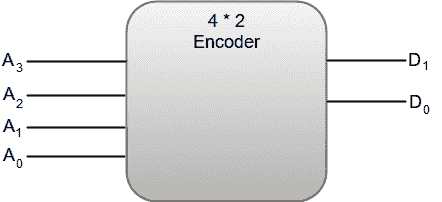
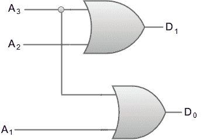
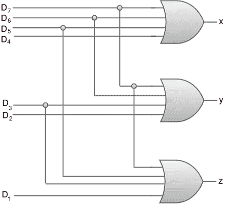

# 编码器

> 原文：<https://www.javatpoint.com/encoders>

编码器也可以被描述为执行解码器的逆操作的组合电路。编码器最多有 2^n(或更少)条输入线和 n 条输出线。

在编码器中，输出线产生对应于输入值的二进制代码。

下图显示了具有四条输入线和两条输出线的 4 * 2 编码器的框图。



4 对 2 线路编码器的真值表可以表示为:

| A3 号 | 主动脉第二声 | 一流的 | A0 | D1 | D0 |
| Zero | Zero | Zero | one | Zero | Zero |
| Zero | Zero | one | Zero | Zero | one |
| Zero | one | Zero | Zero | one | Zero |
| one | Zero | Zero | Zero | one | one |

从真值表中，我们可以将每个输出的布尔函数写成:

```
D1 = A3 + A2
D0 = A3 + A1

```

4 到 2 线编码器的电路图可以通过使用两个输入或门来表示。



编码器最常见的应用是**八进制到二进制**编码器。八进制到二进制编码器采用八条输入线并产生三条输出线。

下图显示了 8 * 3 线编码器的框图。


8 * 3 线编码器的真值表可以表示为:

| D7 | D6 | D5 | D4 | D3 | D2 | D1 | D0 | x | y | z |
| Zero | Zero | Zero | Zero | Zero | Zero | Zero | one | Zero | Zero | Zero |
| Zero | Zero | Zero | Zero | Zero | Zero | one | Zero | Zero | Zero | one |
| Zero | Zero | Zero | Zero | Zero | one | Zero | Zero | Zero | one | Zero |
| Zero | Zero | Zero | Zero | one | Zero | Zero | Zero | Zero | one | one |
| Zero | Zero | Zero | one | Zero | Zero | Zero | Zero | one | Zero | Zero |
| Zero | Zero | one | Zero | Zero | Zero | Zero | Zero | one | Zero | one |
| Zero | one | Zero | Zero | Zero | Zero | Zero | Zero | one | one | Zero |
| one | Zero | Zero | Zero | Zero | Zero | Zero | Zero | one | one | one |

从真值表中，我们可以将每个输出的布尔函数写成:

```
x = D4 + D5 + D6 + D7
y = D2 + D3 + D6 + D7
z = D1 + D3 + D5 + D7

```

8 * 3 线编码器的电路图可以通过使用两个输入或门来表示。

