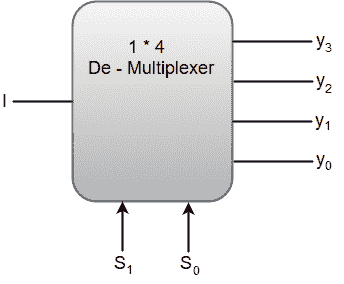
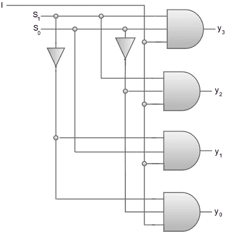
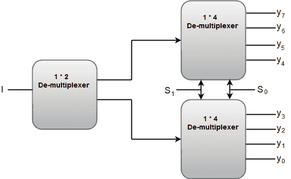

# 多路分解器

> 原文：<https://www.javatpoint.com/de-multiplexers>

多路分解器(多路分解器)可以被描述为执行多路复用器的反向操作的组合电路。

A De-multiplexer has a single input, 'n' selection lines and a maximum of 2^n outputs.

下图显示了 1 * 4 多路分解器的框图。



1 * 4 解复用器的功能表可以表示为:

| S1 | S0 | y3 | y2 | y1 | y0 |
| Zero | Zero | Zero | Zero | Zero | 我 |
| Zero | one | Zero | Zero | 我 | Zero |
| one | Zero | Zero | 我 | Zero | Zero |
| one | one | 我 | Zero | Zero | Zero |

从上面的函数表中，我们可以将每个输出的布尔函数写成:

```
y3 = S1S0 I, y2 = S1S0' I, y1 = S1' S0 I, y0 = S1'S0' I

```

上述等式可以使用反相器和三输入与门来实现。



我们也可以使用低阶解复用器来实现高阶解复用器。例如，让我们实现一个 1 * 8 解复用器，在第一级使用 1 * 2 解复用器，然后在第二级使用两个 1 * 4 解复用器。

1 * 8 解复用器的功能表可以表示为:

| S2 | S1 | S0 | y7 | y6 | y5 | y4 | y3 | y2 | y1 | y0 |
| Zero | Zero | Zero | Zero | Zero | Zero | Zero | Zero | Zero | Zero | 我 |
| Zero | Zero | one | Zero | Zero | Zero | Zero | Zero | Zero | 我 | Zero |
| Zero | one | Zero | Zero | Zero | Zero | Zero | Zero | 我 | Zero | Zero |
| Zero | one | one | Zero | Zero | Zero | Zero | 我 | Zero | Zero | Zero |
| one | Zero | Zero | Zero | Zero | Zero | 我 | Zero | Zero | Zero | Zero |
| one | Zero | one | Zero | Zero | 我 | Zero | Zero | Zero | Zero | Zero |
| one | one | Zero | Zero | 我 | Zero | Zero | Zero | Zero | Zero | Zero |
| one | one | one | 我 | Zero | Zero | Zero | Zero | Zero | Zero | Zero |

1 * 8 解复用器的框图可以表示为:



选择线“S1”和“S0”对于两个 1 * 4 解复用器都是公共的。