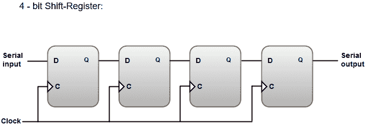

# 移位寄存器

> 原文：<https://www.javatpoint.com/shift-registers>

移位寄存器能够在一个或两个方向上移位它们的二进制信息。移位寄存器的逻辑配置由一系列触发器组成，一个触发器的输出连接到下一个触发器的输入。

#### 注意:为了控制移位流，即二进制信息从一个寄存器流向下一个寄存器，一个公共时钟连接到所有串联的寄存器。该时钟产生一个时钟脉冲，启动从一级到下一级的转换。

下图显示了移位寄存器及其配置的框图。

移位寄存器的基本配置包含以下几点:

*   最通用的移位寄存器通常被称为**双向移位寄存器，具有并行负载**。
*   每个寄存器串联一个公共时钟，以同步所有操作。
*   串行输入线与最左边的寄存器相关联，串行输出线与最右边的寄存器相关联。
*   连接控制状态，即使连续施加时钟脉冲，也保持寄存器中的信息不变。