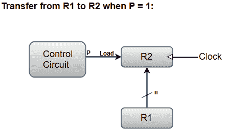

# 寄存器传送

> 原文：<https://www.javatpoint.com/coa-register-transfer>

术语“寄存器传输”指的是硬件逻辑电路的可用性，它可以执行给定的微操作，并将操作结果传输到相同或另一个寄存器。

用于指定各种寄存器操作的大多数标准符号如下所述。

*   存储器地址寄存器由 **MAR** 指定。
*   程序计数器 **PC** 保存下一条指令的地址。
*   指令寄存器 **IR** 保存正在执行的指令。
*   **R1** (处理器寄存器)。
*   我们还可以通过将各个位放在括号中来表示它们。比如 PC (8-15)，R2 (5)等。
*   从一个寄存器到另一个寄存器的数据传输通过替换运算符以符号形式表示。例如，以下声明表示将 R1 登记册的数据转移到 R2 登记册。

```

  R2 ← R1

```

*   通常，大多数用户希望传输仅在预定的控制条件下发生。这可以通过以下 if-then 语句来表示:
    If(P = 1)then(R2←R1)；这里，P 是在控制部分中产生的控制信号。
*   通过将控制变量与寄存器传输操作分开来指定控制函数(P)更方便。例如，以下语句定义了特定控制功能下的数据传输操作。

```

  P:  R2 ← R1

```

下图显示了描述从 R1 到 R2 的数据传输的框图。



这里，字母“n”表示寄存器的位数。寄存器 R1 的“n”个输出连接到寄存器 R2 的“n”个输入。

负载输入由控制变量“P”激活，该变量被传送到 R2 寄存器。