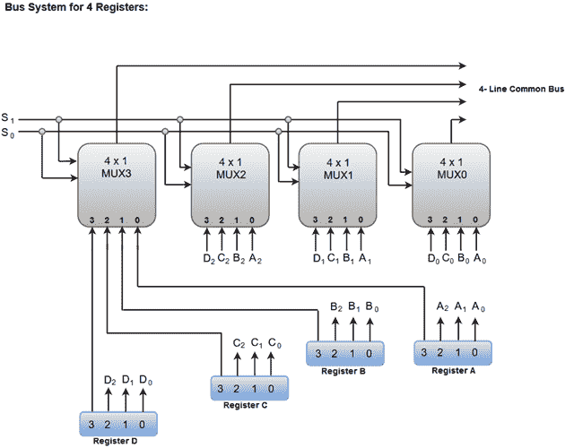
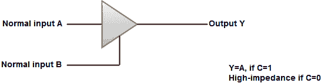
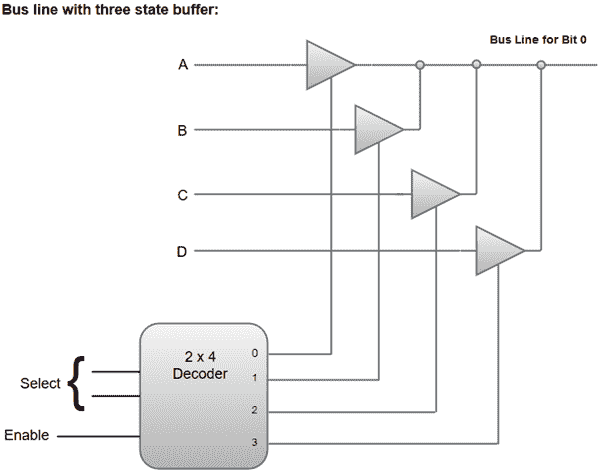
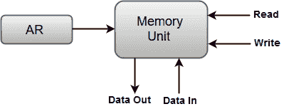

# 总线和内存传输

> 原文：<https://www.javatpoint.com/coa-bus-and-memory-transfers>

由许多寄存器组成的数字系统，必须提供路径将信息从一个寄存器传送到另一个寄存器。如果在系统中的每个寄存器和所有其他寄存器之间使用单独的线路，连接所有寄存器的线路数量将会过多。

另一方面，总线结构对于在多寄存器配置系统中的寄存器之间传输信息更有效。

总线由一组公共线组成，寄存器的每一位都有一条公共线，二进制信息通过这些公共线一次传输一条。控制信号决定在特定寄存器传输期间总线选择哪个寄存器。

下面的框图显示了一个包含四个寄存器的总线系统。它是在四个 4 * 1 多路复用器的帮助下构建的，每个多路复用器有四个数据输入(0 到 3)和两个选择输入(S1 和 S2)。

我们使用标签使您更方便地理解总线系统的四个寄存器的输入输出配置。例如，寄存器 A 的输出 1 连接到 MUX1 的输入 0。



两条选择线 S1 和 S2 连接到所有四个多路复用器的选择输入端。选择线选择一个寄存器的四个位，并将它们传输到四线公共总线。

当两条选择线都处于逻辑低电平时，即 S1S0 = 00，所有四个多路复用器的 0 数据输入被选择并施加到形成总线的输出端。这又导致总线接收寄存器 A 的内容，因为该寄存器的输出连接到多路复用器的 0 数据输入。

同样，当 S1S0 = 01 时，选择寄存器 B，总线将接收寄存器 B 提供的内容。

下表显示了总线为选择线的四个可能二进制值中的每一个选择的寄存器。


#### 注:构建总线所需的多路复用器数量等于每个寄存器的位数。每个多路复用器的大小必须为“k * 1”，因为它多路复用“k”条数据线。例如，一条用于 8 个 16 位寄存器的公共总线需要 16 个多路复用器，总线中的每条线路一个多路复用器。每个多路复用器必须有八条数据输入线和三条选择线，以多路复用八个寄存器中的一个有效位。

也可以使用**三态门**代替多路复用器来构建总线系统。

**三个状态门**可以被认为是一个具有三个门的数字电路，其中两个门是等同于传统门中的逻辑 1 和 0 的信号。然而，第三栅极呈现高阻抗状态。

总线系统中最常用的三个状态门是**缓冲门**。

三态缓冲门的图形符号可以表示为:



下图演示了具有三态缓冲器的总线系统的结构。



*   四个缓冲器产生的输出连接起来形成一条总线。
*   在给定时间点，只能有一个缓冲区处于活动状态。
*   缓冲器的控制输入决定四个正常输入中的哪一个将与总线通信。
*   2 * 4 解码器可确保在任何给定时间点，只有一个控制输入处于活动状态。

## 转储

用于指定内存传输操作的大多数标准符号如下所述。

*   从存储单元到用户端的信息传输称为**读取**操作。
*   要存储在存储器中的新信息的传送称为**写入**操作。
*   记忆单词由字母 **M** 指定。
*   我们必须在写入内存传输操作时指定内存字的地址。
*   **地址寄存器**由 **AR** 指定，**数据寄存器**由 **DR** 指定。
*   因此，读操作可以表述为:

```

  Read:  DR ← M [AR] 

```

*   **Read** 语句导致信息从地址寄存器(AR)选择的存储字(M)传输到数据寄存器(DR)。
*   相应的写操作可以表述为:

```

  Write: M [AR] ← R1

```

*   写语句导致信息从 R1 寄存器传输到由地址寄存器选择的存储字。

