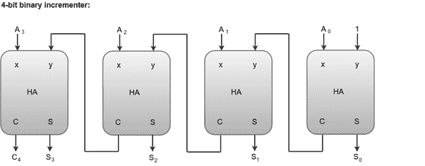

# 二元增量器

> 原文：<https://www.javatpoint.com/coa-binary-incrementer>

增量微操作将一个二进制值加到存储在寄存器中的二进制变量值上。例如，一个 4 位寄存器有一个二进制值 0110，当该值加 1 时变成 0111。

增量微操作最好由 4 位组合电路增量器实现。4 位组合电路增量器可以由下面的框图表示。

*   逻辑 1 加到最低有效半加法器的一个输入端，另一个输入端连接到要递增的数字的最低有效位。
*   一个半加法器的输出进位连接到下一个高阶半加法器的输入端之一。
*   二进制增量器电路接收从 A0 到 A3 的四位，加 1，并在 S0 到 S3 产生增量输出。
*   只有在二进制 1111 递增后，输出进位 C4 才会为 1。

#### 注意:4 位二进制增量器电路可以扩展为 n 位二进制增量器，方法是将电路扩展为包括 n 个半加法器。最低有效位必须有一个输入连接到逻辑 1。其他输入接收要递增的数字或前一级的进位。