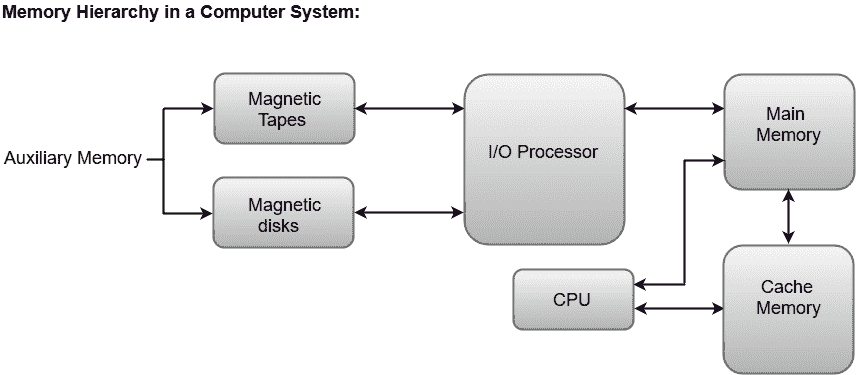

# 分级存储器体系

> 原文：<https://www.javatpoint.com/coa-memory-hierarchy>

存储单元是任何数字计算机中必不可少的组件，因为它是存储程序和数据所必需的。

通常，存储单元可以分为两类:

1.  与中央处理器建立直接通信的存储单元称为**主存储器**。主存储器通常被称为随机存取存储器。
2.  提供备份存储的存储单元称为**辅助存储器**。例如，磁盘和磁带是最常用的辅助存储器。

除了内存单元的基本分类之外，内存层次结构还包括计算机系统中所有可用的存储设备，从速度慢但容量大的辅助内存到速度相对较快的主内存。

下图说明了典型内存层次结构中的组件。

## 辅助存储器

辅助存储器被认为是计算机系统中成本最低、容量最高、存取最慢的存储器。辅助存储器为程序和数据提供存储，这些程序和数据可以长期保存，也可以不立即使用。辅助存储器最常见的例子是磁带和磁盘。

磁盘是一种数字计算机存储器，它使用磁化过程来写入、重写和访问数据。例如，硬盘、压缩盘和软盘。

磁带是一种存储介质，允许对不同类型的数据进行归档、收集和备份。

## 主存储器

计算机系统中的主存储器通常被称为**随机存取存储器(RAM)** 。该存储单元通过输入/输出处理器直接与中央处理器和辅助存储设备通信。

主存储器中当前不需要的程序被转移到辅助存储器中，为当前使用的程序和数据提供空间。

## 输入输出处理器

输入输出处理器的主要功能是管理辅助存储器和主存储器之间的数据传输。

## 高速缓冲存储器

中央处理器经常使用的主存储器的数据或内容存储在高速缓冲存储器中，以便处理器可以在更短的时间内轻松访问这些数据。每当中央处理器需要访问内存时，它首先将所需的数据检查到缓存中。如果在高速缓冲存储器中找到数据，则从快速存储器中读取数据。否则，中央处理器会移动到主内存中获取所需的数据。

我们将在本章后面更详细地讨论内存层次结构的每个组件。