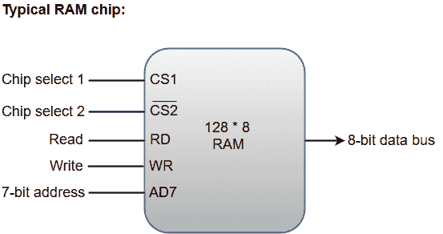
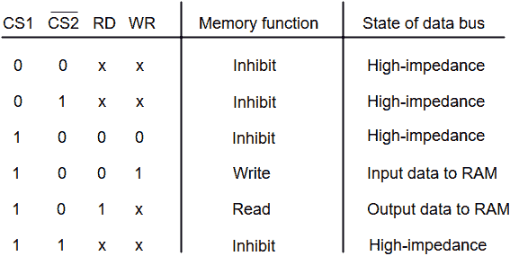
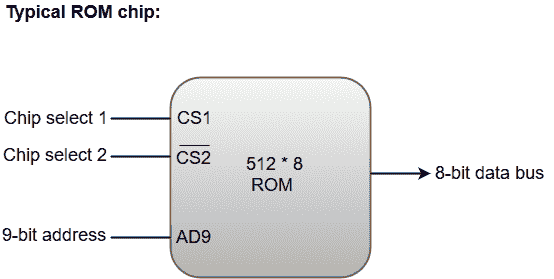

# 主存储器

> 原文：<https://www.javatpoint.com/coa-main-memory>

主存储器在计算机系统中充当中央存储单元。它是一个相对较大且速度较快的内存，用于在运行时操作期间存储程序和数据。

用于主存储器的主要技术是基于半导体集成电路。主存储器的集成电路分为两大部分。

1.  随机存取存储器集成电路芯片
2.  只读存储器集成电路芯片

## 随机存取存储器集成电路芯片

RAM 集成电路芯片进一步分为两种可能的工作模式，**静态**和**动态**。

静态随机存储器的主要组成部分是存储二进制信息的触发器。存储信息的性质是易变的，即只要系统通电，它就保持有效。与动态内存相比，静态内存易于使用，执行读写操作所需的时间更少。

动态随机存取存储器以电荷的形式向电容器展示二进制信息。电容通过金属氧化物半导体晶体管集成在芯片内部。动态随机存取存储器功耗更低，并且在单个存储芯片中提供大存储容量。

随机存取存储器芯片有多种尺寸可供选择，并根据系统要求使用。下面的框图演示了 128 * 8 内存芯片中的芯片互连。

*   128 * 8 内存芯片的存储容量为 128 个字，每个字八位(一个字节)。这需要 7 位地址和 8 位双向数据总线。
*   8 位双向数据总线允许数据在**读取**操作期间从内存传输到中央处理器，或者在**写入**操作期间从中央处理器传输到内存。
*   **读**和**写**输入指定存储器操作，两个芯片选择(CS)控制输入仅在微处理器选择芯片时用于使能芯片。
*   双向数据总线使用**三态缓冲器**构建。
*   三态缓冲器产生的输出可以处于三种可能状态之一，包括等效于逻辑 1 的信号、等于逻辑 0 的信号或高阻抗状态。

#### 注意:逻辑 1 和 0 是标准的数字信号，而高阻抗状态表现得像开路，这意味着输出不携带信号，没有逻辑意义。

下面的功能表指定了 128 * 8 内存芯片的操作。

从功能表中我们可以得出，只有当 CS1 = 1、 CS2 = 0 时，机组才处于运行状态。第二个选择变量顶部的条表示当它等于 0 时，该输入被启用。

## 只读存储器集成电路

主存储器的主要部件是随机存取存储器集成电路芯片，但是存储器的一部分可以由只读存储器芯片构成。

只读存储器用于保存永久驻留在计算机中的程序和数据。

Apart from the permanent storage of data, the ROM portion of main memory is needed for storing an initial program called a **bootstrap loader**. The primary function of the **bootstrap loader** program is to start the computer software operating when power is turned on.

只读存储器芯片也有多种尺寸可供选择，也可根据系统要求使用。下面的框图演示了 512 * 8 只读存储器芯片中的芯片互连。

*   只读存储器芯片与随机存取存储器芯片具有相似的结构。然而，只读存储器只能执行读操作；数据总线只能在输出模式下工作。
*   只读存储器芯片中的 9 位地址线指定存储在其中的 512 个字节中的任何一个。
*   芯片选择 1 和芯片选择 2 的值必须为 1 和 0，设备才能工作。否则，数据总线被称为处于高阻抗状态。